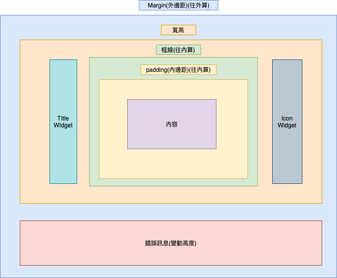

# 單元樣式

* ## Web支援版本

        8.10.0

* ## APP 支援版本

        008.010.000049 以上(含)

### 
示意圖

  * 樣式結構圖
  
    

* __支援類型__
  * 致能(Apps_Enable)
    * 元件類型
      * 文字標題
      * 文字方塊
      * 多行文字
      * 下拉選項
      * 清單選項
      * 按鈕群組
      * 按鈕選項
      * 核取方塊
      * 框線
      * 圖片
      * 元件容器
      * 畫布
      * 嵌入物件
      * 功能按鈕
  * 除能(Apps_Disable)
    * 元件類型
      * 功能按鈕
  * 顯示致能(Apps_DisplayEnable)
    * 元件類型
      * 文字方塊
      * 多行文字
      * 按鈕選項
      * 下拉選項
      * 清單選項
      * 嵌入物件
      * 核取方塊
  * 駐留(Apps_OnFocus)
    * 元件類型
      * 文字方塊
      * 多行文字
      * 畫布
  * 標題(Apps_Title)
    * 元件類型
      * 文字方塊
      * 多行文字
      * 按鈕群組
      * 按鈕選項
      * 下拉選項
      * 清單選項
      * 嵌入物件
      * 圖片
      * 畫布
      * 核取方塊
  * 點擊(Apps_OnClick)
    * 元件類型
      * 功能按鈕
  * 區塊(Apps_Block)
    * 元件類型
      * 元件容器
  * 選項清單(Apps_Item_List)
    * 元件類型
      * 下拉選項
* __常用樣式__
  * __底色__
    * 顏色(`有設定時漸層色無效`)
            RGB格式
    * 透明度
            數字格式，0~100(不透明)
    * 漸層色(`漸層色會往白色漸變，漸層方向未設定時無效`)
            RGB格式
    * 漸層方向(`漸層色未設定時無效`)
      * 無
      * 上
      * 下
      * 左
      * 右
      * 垂直
      * 水平
      * 往內
      * 往外
  * __內容__
    * 文字顏色
            RGB格式
    * 透明度
            數字格式，0~100(不透明)
    * _字型(不支援)_
    * 大小
            數字格式, px
    * 水平
      * 靠左
      * 置中
      * 靠右
    * 垂直
      * 靠上
      * 置中
      * 靠下
    * 字型樣式
      * 粗體
      * 斜體
      * 底線
      * 刪除線
    * 超連結
      * 點擊前
            RGB格式
      * 點擊後
            RGB格式
  * __框線__
    * 線條
      * 無
      * 實線
      * 虛線
      * 嵌入線
      * 浮出線
    * 圓角
    * 上框線
      * 寬度
            數字格式, px
      * 顏色
            RGB格式
    * 下框線
      * 寬度
            數字格式, px
      * 顏色
            RGB格式
    * 左框線
      * 寬度
            數字格式, px
      * 顏色
            RGB格式
    * 右框線
      * 寬度
            數字格式, px
      * 顏色
            RGB格式
  * __邊界__
    * 內邊距
      * 上
            數字格式, px
      * 下
            數字格式, px
      * 左
            數字格式, px
      * 右
            數字格式, px
    * 外邊距
      * 上
            數字格式, px
      * 下
            數字格式, px
      * 左
            數字格式, px
      * 右
            數字格式, px
* __進階樣式__
  * 光棒
    * 元件類型
      * 下拉選項
      * 清單選項
      * 元件容器
    * 線條
      * 無
      * 實線
      * 虛線
      * 嵌入線
      * 浮出線
    * 上框線
      * 寬度
            數字格式, px
      * 顏色
            RGB格式
    * 下框線
      * 寬度
            數字格式, px
      * 顏色
            RGB格式
    * 左框線
      * 寬度
            數字格式, px
      * 顏色
            RGB格式
    * 右框線
      * 寬度
            數字格式, px
      * 顏色
            RGB格式
    * 顏色(`有設定時漸層色無效`)
        RGB格式
    * 透明度
        數字格式，0~100(不透明)
    * 漸層色(`漸層色會往白色漸變，漸層方向未設定時無效`)
        RGB格式
    * 漸層方向(`漸層色未設定時無效`)
      * 無
      * 上
      * 下
      * 左
      * 右
      * 垂直
      * 水平
      * 往內
      * 往外