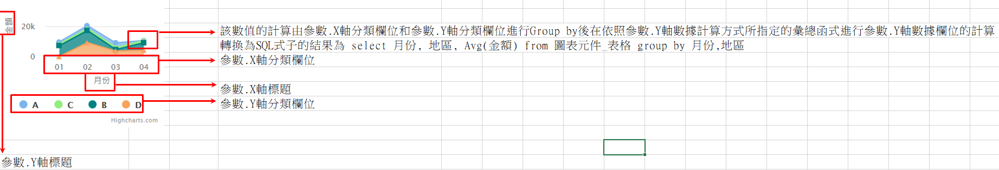

### 
堆疊區域圖 <path>(物件類別\圖表\圖表類型)

| 參數名稱        | 可空白	  	  | 來源型態	   | 參數說明	    |
|:------------- |:------------- |:------------- |:------------- |
| 類型	| 	| 選項	| 基本型 / 百分比型| 
| 圖表標題	| V	| 多語詞庫	| 顯示圖表的標題| 
| X軸標題	| 	| 多語詞庫	| X軸顯示標題| 
| Y軸標題	| 	| 多語詞庫	| Y軸顯示標題| 
| 來源邏輯表格	| 	| 檢視表	| 顯示圖表的資料來源| 
| 來源過濾運算式	| V	| 條件式	| 顯示圖表的資料來源過濾式| 
| X軸分類欄位	| 	| 查表欄位	| 圖表X軸分群用的欄位名稱| 
| Y軸分類欄位	| V	| 查表欄位	| 圖表Y軸分群用欄位名稱| 
| Y軸數據欄位	| 	| 查表欄位	| 主圖表Y軸數據欄位名稱| 
| Y軸數據計算方式	| 	| 選項	| 1.Max : 顯示Y軸數據欄位的最大值 2.Min : 顯示Y軸數據欄位的最小值 3.Sum : 顯示Y軸數據欄位的總和 4.Avg : 顯示Y軸數據欄位的平均值 5.Count : 顯示Y軸數據欄位的數量 | 
| 排序方式	| V	| 選項	| 1.升冪/2.降冪  | 未設定時為升冪| 
| 顯示資料時的單位	| V	| 多語詞庫	| 顯示在數據資料後的單位名稱| 
| 是否在線圖上顯示資料值	| 	| 選項	| TRUE / FALSE| 
| 標題替換字1	| V	| 運算式	| 替換圖表標題裡%P1的值| 
| 標題替換字2	| V	| 運算式	| 替換圖表標題裡%P2的值| 

* 範例說明

    堆疊區域圖設定

    | 參數名稱	| 來源型態	| 來源內容| 
    |:------------- |:------------- |:------------- |
    | 類型	| 選項	| 百分比型| 
    | X軸標題	| 多語詞庫	| 月份| 
    | Y軸標題	| 多語詞庫	| 金額| 
    | 來源邏輯表格| 檢視表	| 圖表元件_表格| 
    | X軸分類欄位		| 查表欄位	| 月份| 
    | Y軸分類欄位		| 查表欄位	| 地區| 
    | Y軸數據欄位		| 查表欄位	| 金額| 
    | Y軸數據計算方式	| 選項	| Avg| 
    | 是否在線圖上顯示資料值	| 選項	| FALSE| 

    檢視表.圖表元件_表格

    | 地區	| 年度	| 金額	|
    |:------------- |:------------- |:------------- |
    | A	| 01	| 8525| 
    | A	| 02	| 15100| 
    | A	| 03	| 3833| 
    | C	| 01	| 3100| 
    | C	| 02	| 3200| 
    | C	| 03	| 3300| 
    | C	| 04	| 1400| 
    | B	| 01	| 6700| 
    | B	| 02	| 7400| 
    | B	| 03	| 1000| 
    | B	| 04	| 5000| 
    | D	| 01	| 8100| 
    | D	| 02	| 8733| 
    | D	| 03	| 5100| 
    | D	| 04	| 4000| 

    依據設定配合資料，圖表元件顯示結果如下圖所示

    