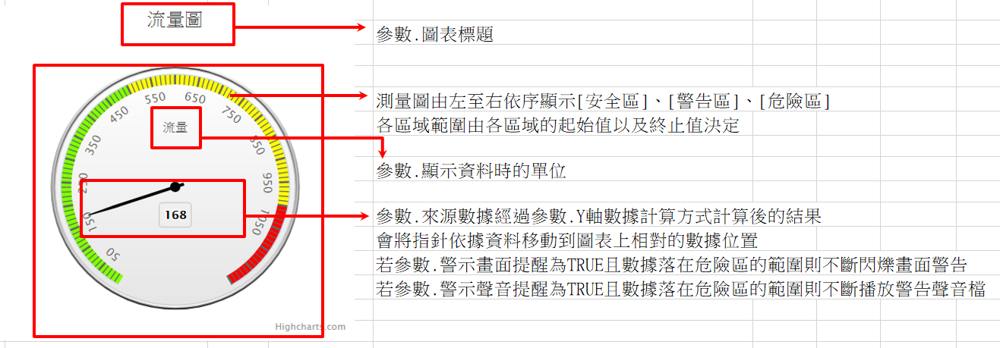

### 
測量圖 <path>(物件類別\圖表\圖表類型)

| 參數名稱        | 可空白	  	  | 來源型態	   | 參數說明	    |
|:------------- |:------------- |:------------- |:------------- |
| 圖表標題	| V	| 多語詞庫	| 顯示圖表的標題| 
| 顯示資料時的單位	| 	| 多語詞庫	| 表示目前的顯示資料單位| 
| 最小數字	| 	| 固定值	| 圖表測量範圍最小值| 
| 最大數字	| 	| 固定值	| 圖表測量範圍最大值| 
| 安全區顏色	| 	| 色盤	| 測量數值安全區的顏色| 
| 安全區起始值	| 	| 固定值	| 測試數值安全區的起始值| 
| 安全區終止值	| 	| 固定值	| 測試數值安全區的終止值| 
| 警示區顏色	| 	| 色盤	| 測量數值警示區的顏色| 
| 警示區起始值	| 	| 固定值	| 測試數值警示區的起始值| 
| 警示區終止值	| 	| 固定值	| 測試數值警示區的終止值| 
| 危險區顏色	| 	| 色盤	| 測量數值危險區的顏色| 
| 危險區起始值	| 	| 固定值	| 測試數值危險區的起始值| 
| 危險區終止值	| 	| 固定值	| 測試數值危險區的終止值| 
| 來源邏輯表格	| 	| 檢視表	| 顯示圖表的資料來源| 
| 來源過濾運算式	| V	| 條件式	| 顯示圖表的資料來源過濾式| 
| 來源數據		| | 查表欄位	| 顯示圖表的資料欄位| 
| Y軸數據計算方式	| 	| 選項	| 1.Max : 顯示Y軸數據欄位的最大值 2.Min : 顯示Y軸數據欄位的最小值 3.Sum : 顯示Y軸數據欄位的總和 4.Avg : 顯示Y軸數據欄位的平均值 5.Count : 顯示Y軸數據欄位的數量| 
| 多久重新查詢一次畫面	| 	| 固定值	| 多久重新查詢一次畫面(秒)| 
| 警示畫面提醒	| 	| 選項	| 若測試值在危險範圍區間，是否以閃爍畫面警告| 
| 警示聲音提醒	| 	| 選項	| 若測試值在危險範圍區間，是否以播放聲音警告| 
| 標題替換字1	| V	| 運算式	| 替換圖表標題裡%P1的值| 
| 標題替換字2	| V	| 運算式	| 替換圖表標題裡%P2的值| 

* 範例說明

    測量圖設定

    | 參數名稱	| 來源型態	| 來源內容| 
    |:------------- |:------------- |:------------- |
    | 圖表標題	| 多語詞庫	| 流量圖| 
    | 顯示資料時的單位		| 多語詞庫	| 流量| 
    | 最小數字		| 固定值	| 1| 
    | 最大數字		| 固定值	| 1200| 
    | 安全區顏色	| 	色盤	| #7FFF00| 
    | 安全區起始值	| 	固定值	| 1| 
    | 安全區終止值	| 	固定值	| 500| 
    | 警示區顏色	| 	色盤	| #FFFF00| 
    | 警示區起始值	| 	固定值	| 501| 
    | 警示區終止值	| 	固定值	| 1000| 
    | 危險區顏色	| 	色盤	| #FF0000| 
    | 危險區起始值	| 	固定值	| 1001| 
    | 危險區終止值	| 	固定值	| 1200| 
    | 來源邏輯表格	| 	檢視表	| 資料表.機台網路流量數據清單| 
    | 來源過濾運算式| 	條件式	| 欄位.所在區域=A| 
    | 來源數據		| 查表欄位	| 欄位.目前網路流量| 
    | Y軸數據計算方式	| 	選項	| Avg| 
    | 多久重新查詢一次畫面	| 	固定值	| 5| 
    | 警示畫面提醒		| 選項	| FALSE| 
    | 警示聲音提醒		| 選項	| FALSE| 

    檢視表.元件加註-嵌入物件_散佈圖

    | 所在區域	| 機台名稱	| 目前網路流量	| 過濾條件成立
    |:------------- |:------------- |:------------- |:------------- |
    | A	| A1	| 100| V|
    | A	| A2	| 168| V|
    | A	| A3	| 228| V|
    | B	| B1	| 95| |
    | B	| B2	| 50| |
    | B	| B3	| 87| |

    依據設定配合資料，圖表元件顯示結果如下圖所示

    