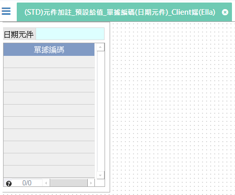

[上一頁]({back})
# (STD)元件加註_預設給值_單據編碼(日期元件)_Client端(Ella)

## 元件說明
* 日期元件：取得系統日期的當月最後一天。
* 單據編碼：依`照編碼格式`(YYYY-MM-DD-99)產生編碼流水號。
    * YYYY：`日期基礎`=`日期元件`，產生元件.日期元件的年度4碼。
    * -：固定內容。
    * MM：`日期基礎`=`日期元件`，產生元件.日期元件的月份2碼。
    * -：固定內容。
    * DD：`日期基礎`=`日期元件`，產生元件.日期元件的日期2碼。
    * -：固定內容。
    * 99：0 ~ 9。