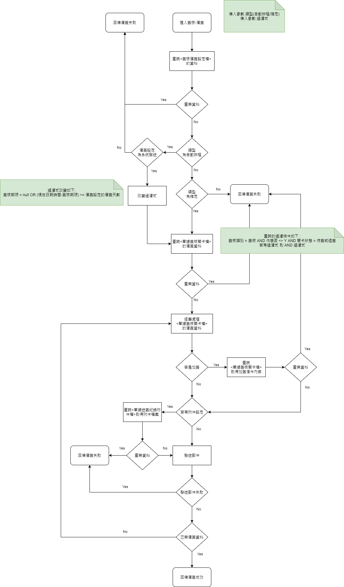
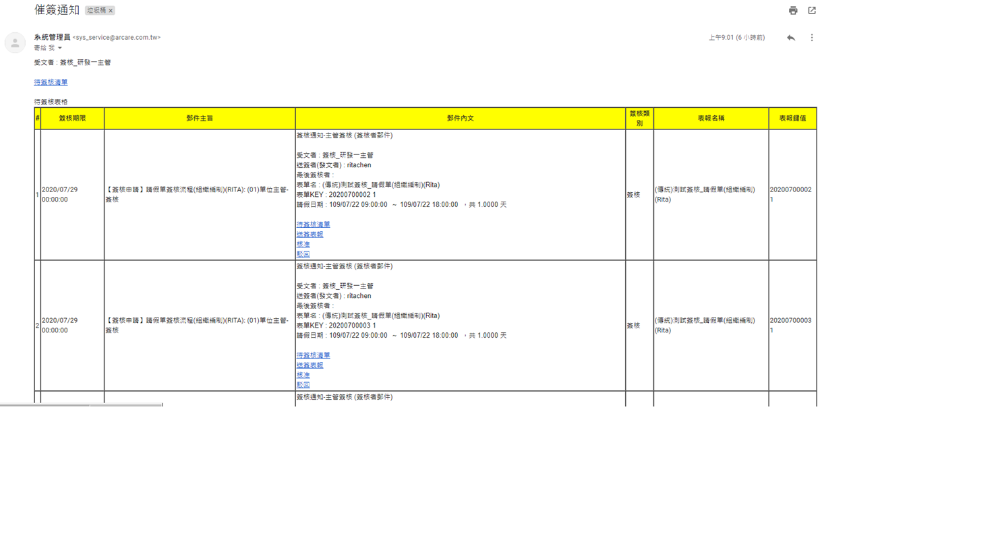

### 
功能說明

* 針對已經超過簽核期限的簽核人員發出催促簽核的通知，可設定以下兩種催簽的方式
    * 自動催簽 : 設定排程執行自動催簽的功能鍵，當排程執行時，會針對以下條件的資料以郵件發送的方式進行催簽。
        * 簽核類別為簽核且不為作廢紀錄
        * 未設定簽核期限或目前已超過催簽設定的期限天數
    * 手動催簽 : 執行功能鍵進行催簽的動作，會針對以下條件的資料以郵件發送的方式進行催簽。
        * 簽核類別為簽核且不為作廢紀錄
        * 該功能鍵指定的簽核資料(存放於表單勾選LOG暫存實體)
* 催簽的郵件內容可夾附檔

### 
功能流程

### 
功能範例畫面

