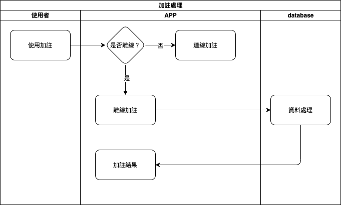

#### 
功能項目名稱

  * 加註處理<path>(資料處理)</path>

#### 
規劃人員

  * Andy

#### 
版本記錄

  |日期|版本|備註|
  |---|---|---|
  |2020/11/09|v1|初始化|

## 
TRAC

  * [#8188](http://trac.uneec.com/trac/neco/ticket/8188)

#### 
規格說明

  * 離線模式時的加註處理
  * 所有連線資料皆轉查本地資料
  * 所有連線功能皆無法使用

#### 
作業流程

  
