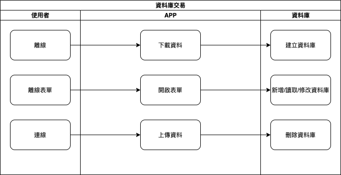

#### 
功能項目名稱

  * 資料交易<path>(資料處理)</path>

#### 
規劃人員

  * Andy

#### 
版本記錄

  |日期|版本|備註|
  |---|---|---|
  |2020/11/09|v1|初始化|

## 
TRAC

  * [#8188](http://trac.uneec.com/trac/neco/ticket/8188)

#### 
規格說明

  * 離線模式時使用本地資料庫(SQLite)
  * 建立時機，成功下載離線資料後
  * 刪除時機，成功上傳離線資料後
  * 功能包含 新增/修改/刪除/查詢 等

#### 
作業流程

  

