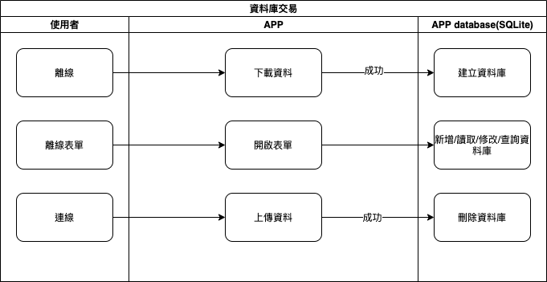

## 
規劃人員

  * Andy

## 
規劃日期

  * 2020/11/09

## 
TRAC

  * 待補

#### 
資料交易<path>(資料庫功能)</path>

* 規格說明
    * 離線時使用本地資料庫(SQLite)
    * 成功下載離線資料後建立
    * 成功上傳離線資料後刪除
    * 用於 新增/修改/刪除/查詢 等功能
* 作業流程

  

