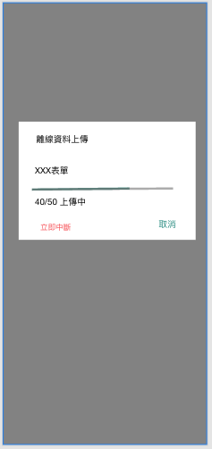
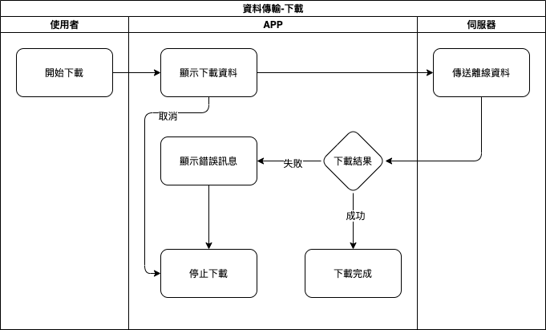
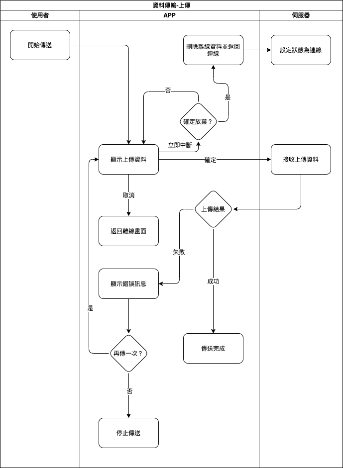

## 
規劃人員

  * Andy

## 
規劃日期

  * 2020/11/09

## 
TRAC

  * 待補

#### 
資料傳輸<path>(資料處理)</path>

* 規格說明
  * 下載離線資料
    * 顯示下載進度[(表單畫面 下載)](#data_transfer_download)
    * 目前無續傳
    * 成功下載後即為離線模式
  * 上傳離線資料
    * 顯示上傳進度[(表單畫面 上傳)](#data_transfer_upload)
    * 目前無續傳
    * 失敗可選擇重新傳送
    * 成功上傳後即為連線模式
* 表單畫面
  * 
下載

  
    

  * 下載錯誤
  
    

  * 
上傳

  
    

  * 上傳錯誤
  
    
  
  * 上傳中斷
  
    

* 作業流程
  * 下載

    
  
  * 上傳

    

