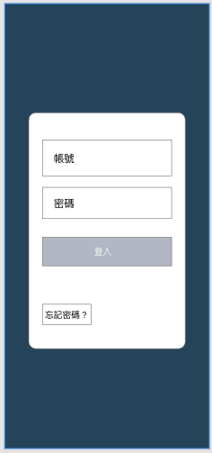
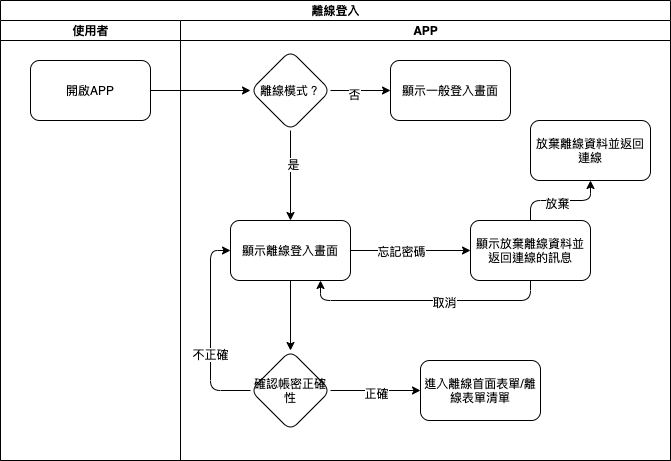

#### 
功能項目名稱

  * 登入<path>(系統功能)</path>

#### 
規劃人員

  * Andy

#### 
版本記錄

  |日期|版本|備註|
  |---|---|---|
  |2020/11/09|v1|初始化|

#### 
TRAC

  * [#8188](http://trac.uneec.com/trac/neco/ticket/8188)

#### 
規格說明

  * 在離線作業時，重新開啟APP時需要驗證最後登入的使用者帳密
  * 帳密會以加密型式保存
  * 在離線作業時登入只能使用所下載的離線任務表單
  * 若忘記密碼則需取消離線模式並切回連線模式

#### 
畫面

  * 表單畫面

    

#### 
作業流程

  

