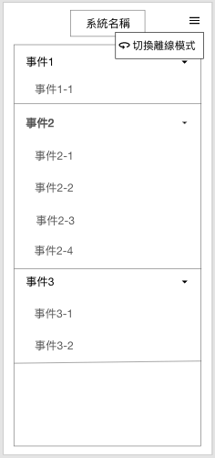
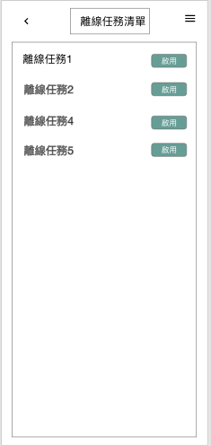
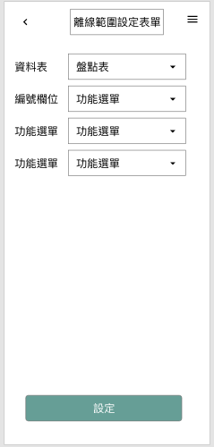
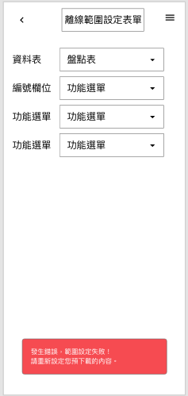
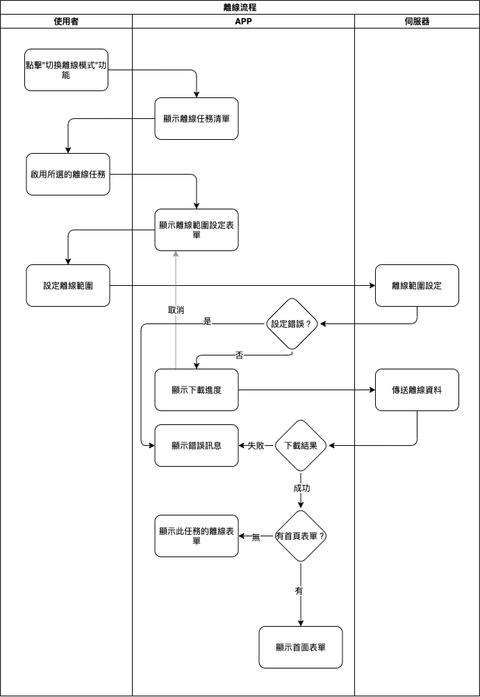

## 
規劃人員

  * Andy

## 
規劃日期

  * 2020/11/09

## 
TRAC

  * 待補

#### 
離線<path>(連線功能)</path>

* 規格說明
  * 系統功能選項 (表單畫面 離線功能)
    * 有離線任務時才會顯示
  * 離線任務清單 (表單畫面 離線任務清單)
    * 一次只能下載一個任務來使用
  * 離線設定範圍表單 (表單畫面 離線設定範圍表單)
    * 需使用者設計
  * 成功下載資料後即變為離線狀態
* 表單畫面
  * 離線功能
  
    

  * 離線任務清單
  
    

  * 離線設定範圍表單
  
    

  * 離線設定範圍表單錯誤
  
    
  
* 作業流程

  

