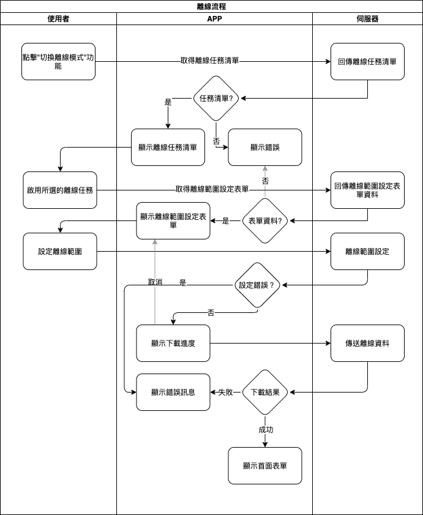

#### 
功能項目名稱

  * 離線<path>(系統功能)</path>

#### 
規劃人員

  * Andy

#### 
版本記錄

  |日期|版本|備註|
  |---|---|---|
  |2020/11/09|v1|初始化|

#### 
TRAC

  * [#8188](http://trac.uneec.com/trac/neco/ticket/8188)

#### 
規格說明

  * 需求展開
    * 系統功能選項 [(表單畫面 離線功能)](#offline_button)
      * 有離線任務時才顯示
    * 離線任務清單 [(表單畫面 離線任務清單)](#offline_list)
      * 一次只能下載一個任務來使用
    * 離線設定範圍表單 [(表單畫面 離線設定範圍表單)](#offline_range)
      * 需使用者設計(預設為關連資料全部載入)
    * 成功下載資料後即變為離線模式

#### 
畫面

  * 表單畫面
    * 
離線功能

    
      

    * 
離線任務清單

    
      

    * 
離線設定範圍表單(需設計者設計)

    
      

    * 
離線設定範圍表單錯誤

    
      
    
#### 
作業流程

  

