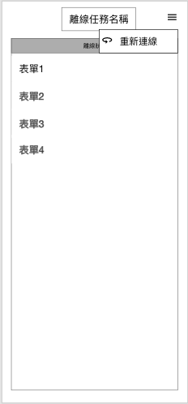
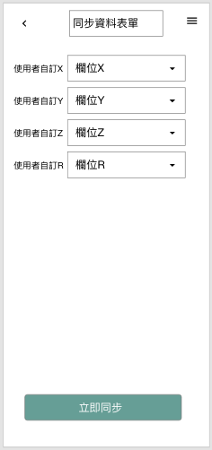
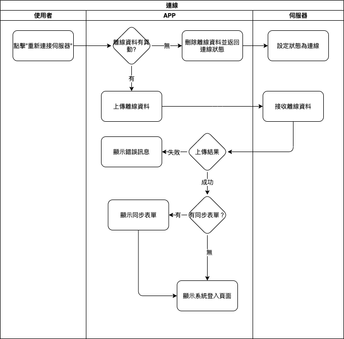

## 
規劃人員

  * Andy

## 
規劃日期

  * 2020/11/09

## 
TRAC

  * 待補

#### 
連線<path>(系統功能)</path>

* 規格說明
  * 在離線模式下，可結束離線模式並返回連線模式[(表單畫面 連線)](#online_button)
  * 可上傳離線模式期間所異動的資料
  * 可直接結束離線模式並返回連線模式
  * 可設計同步表單來同步離線模式期間所異動的資料[(表單畫面 同步資料)](#online_sync)
* 表單畫面
  * 
連線</>
  
    

  * 
同步資料(設計者設計)

  
    

* 作業流程

  
