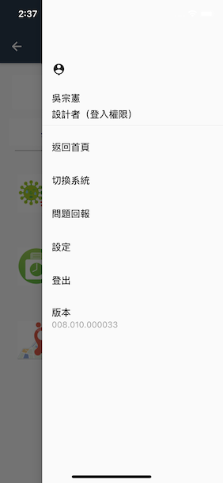

#### 
功能項目名稱

  * 流程表單規格異動

#### 
規劃人員

  * Andy

#### 
版本記錄

  |日期|版本|備註|
  |---|---|---|
  |2021/6/24|v1|初始化|

#### 
TRAC

  * [#8548](http://trac.uneec.com/trac/neco/ticket/8548)

#### 
規格說明

  * 需求展開
    * 流程表單
      * 首頁可切換至功能清單
      * 功能清單可返回首頁(根目錄有流程表單時)
      * 流程表單可返回至首頁(根目錄有流程表單時)及切換系統
    * 功能清單
      * 更換節點開關ICON
      * 修改節點點擊方式
        * 展開/關閉
          * 點擊節點/點擊文字(無流程表單時)
        * 開啟流程表單
          * 點擊文字
    * 打樣(只顯示設定為主要裝置和問題回報)
      * 功能清單
        * 設定為主要裝置
        * 版本
      * 表單
        * 問題回報
        * 設定為主要裝置
        * 版本

#### 
畫面

  * 首頁側拉功能項

  

  * 功能清單側拉功能項

  

  * 流程表單側拉功能項

  

  * 表單側拉功能項

  

  * 功能清單節點展開

  

  * 功能清單節點關閉
  
  

  * 打樣-功能清單
  
  

  * 打樣-表單
  
  

#### 
作業流程

  * 流程表單

  

<!-- #### 
附件

  * [注意事項](Warning.md)-->

