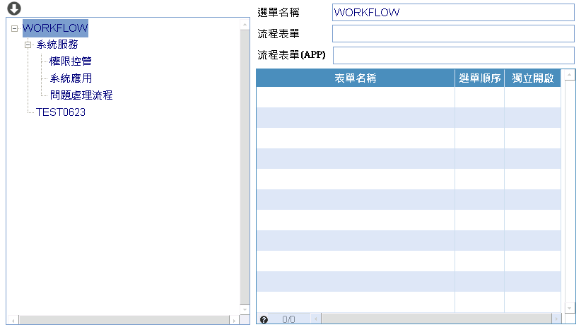

# 流程表單擴充MAE表單設定

### 
規劃人員

* 正傑

### 
規劃日期

* 2021/06/22

### 
TRAC

* #8548

### 
需求展開

* 流程表單, 分RTE/MAE兩種設定, 讓系統主選單的節點可據MAE/RTE進行設定

### <duv id="UTL_FLOWINFO">權限選單建置作業

* 表單畫面

    

* 元件說明
    * 流程表單：開窗挑選非APP的表單
    * 流程表單(APP)：開窗挑選APP的表單

    * <ps>注意</ps> TBL.UTL_FLOWINFO 欄位結構有異動。