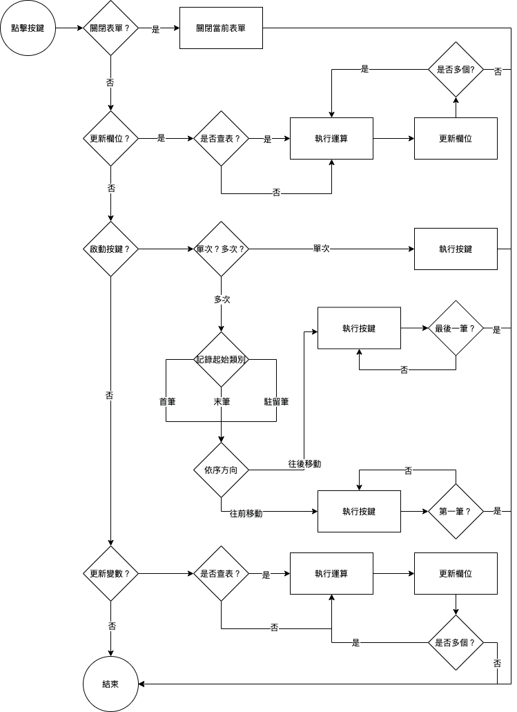

#### 
功能項目名稱

  * 表單特效

#### 
規劃人員

  * Andy

#### 
版本記錄

  |日期|版本|備註|
  |---|---|---|
  |2021/6/16|v1|初始化|

#### 
TRAC

  * [#8549](http://trac.uneec.com/trac/neco/ticket/8549)

#### 
規格說明

  * 需求展開
    * 關閉表單
      * 關閉當前表單
    * 更新欄位
      * 將來源資料(可查表)更新到目的元件(可多個)
    * 啟動按鍵
      * 分單次及多次
      * 可指定容器元件
      * 單次時若在容器元件內則表示駐留筆
      * 多次時可指定起始(首筆/末筆/駐留筆)及方向(往後移動/往前移動)
    * 更新變數
      * 將來源資料(可查表)更新到全域變數(可多個)

#### 
作業流程

  * 表單特效
  
  

#### 
附件

  * [注意事項](Warning.md)
