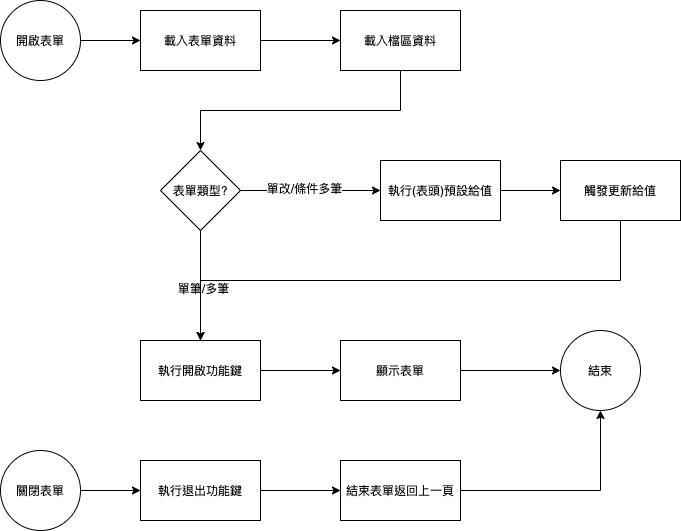

#### 
功能項目名稱

  * 系統功能鍵

#### 
規劃人員

  * Andy

#### 
版本記錄

  |日期|版本|備註|
  |---|---|---|
  |2021/6/16|v1|初始化|

#### 
TRAC

  * [#8550](http://trac.uneec.com/trac/neco/ticket/8550)

#### 
規格說明

  * 需求展開
    * 開啟
      * 執行時機
        * 表單資料載入後到表單顯示前
    * 退出
      * 執行時機
        * 表單結束之前

#### 
作業流程

  * 系統功能鍵
  
  

#### 
附件

  * [注意事項](Warning.md)

