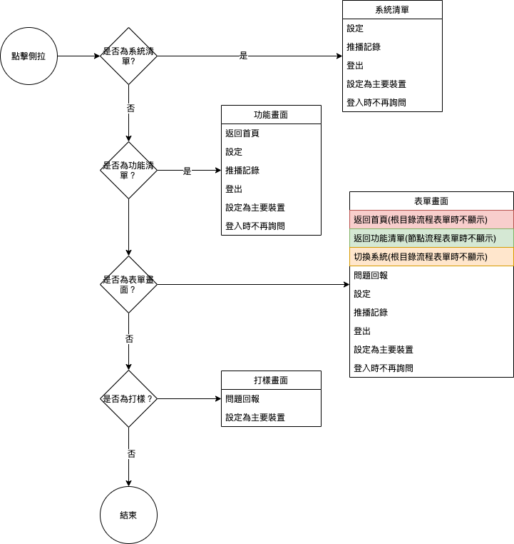

#### 
功能項目名稱

  * 系統選單開啟位置調整

#### 
規劃人員

  * Andy

#### 
版本記錄

  |日期|版本|備註|
  |---|---|---|
  |2021/6/16|v1|初始化|

#### 
TRAC

  * [#8530](http://trac.uneec.com/trac/neco/ticket/8530)

#### 
規格說明

  * 需求展開
    * 調整為右側拉選單
    * 收納系統功能項進側拉選單(返回首頁/切換系統/問題回報等)
    * 功能清單新增右側拉選單
      * 右側拉項目不顯示返回首頁及問題回報
    * 表單新增右側拉選單
      * 右側拉項目不顯示返回首頁(當表單為根目錄流程表單時)
    * 打樣新增右側拉選單
      * 右側拉項目不顯示返回首頁/切換系統/登出

#### 
畫面

  * 系統登入畫面
    
    

  * 系統登入側拉
    
    

  * 功能清單畫面
    
    

  * 功能清單側拉
    
    

  * 表單側拉
    
    

#### 
作業流程

  * 系統側拉
  
  

#### 
附件

  * [注意事項](Warning.md)

