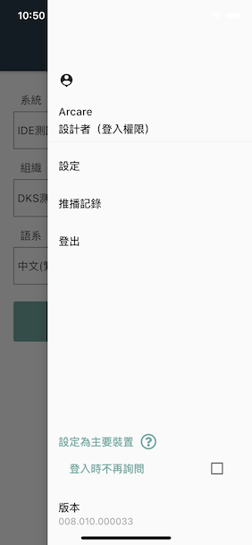
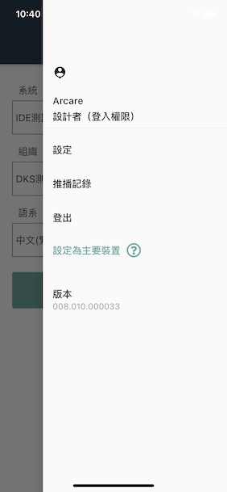
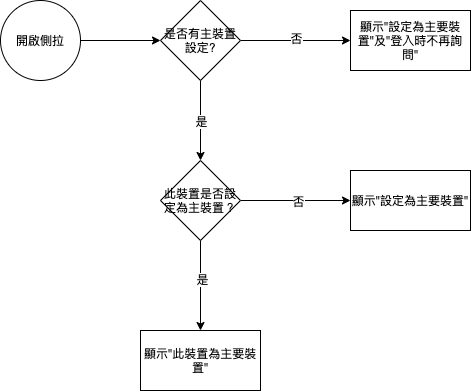

#### 
功能項目名稱

  * 設定主要裝置UIUX修改

#### 
規劃人員

  * Andy

#### 
版本記錄

  |日期|版本|備註|
  |---|---|---|
  |2021/6/16|v1|初始化|

#### 
TRAC

  * [#8530](http://trac.uneec.com/trac/neco/ticket/8530)

#### 
規格說明

  * 需求展開
    * MAE設定主要裝置UIUX修改

#### 
畫面

  * 修改前
    
    

  * 修改後
    
    

#### 
作業流程

  * 主要裝置
  
  

<!-- #### 
附件

  * [注意事項](Warning.md) -->

