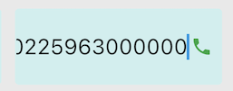

#### 
功能項目名稱

  * 撥號功能於編輯階段仍可撥號

#### 
規劃人員

  * Andy

#### 
版本記錄

  |日期|版本|備註|
  |---|---|---|
  |2021/6/16|v1|初始化|

#### 
TRAC

  * [#8552](http://trac.uneec.com/trac/neco/ticket/8552)

#### 
規格說明

  * 需求展開
    * 元件加註-基本設定-撥號功能
      * 新增編輯時顯示
        * 編輯階段時點擊撥號
          * 儲存現在編輯資料
          * 依現在編輯資料撥打電話

#### 
畫面

  * 純編輯
    
    

  * 編輯含撥號功能
    
    

#### 
作業流程

  * 撥號功能
  
  

<!--#### 
附件

  * [注意事項](Warning.md) -->

