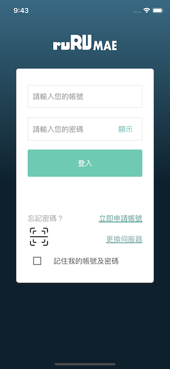
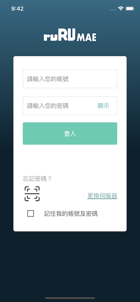
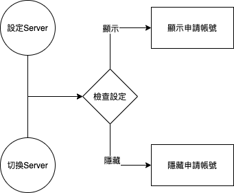

#### 
功能項目名稱

  * 擴充帳號申請依據Site可以開啟隱藏

#### 
規劃人員

  * Andy

#### 
版本記錄

  |日期|版本|備註|
  |---|---|---|
  |2021/6/16|v1|初始化|

#### 
TRAC

  * [#8554](http://trac.uneec.com/trac/neco/ticket/8554)

#### 
規格說明

  * 需求展開
    * 依Site 顯示/隱藏 申請帳號
      * 執行時機
        * 設定為主要Site時
        * 切換Site時

#### 
畫面

  * 顯示 帳號申請
    
    

  * 隱藏 帳號申請

    

#### 
作業流程

  * 顯示/隱藏 帳號申請
  
  

<!--#### 
附件

  * [注意事項](Warning.md) -->

