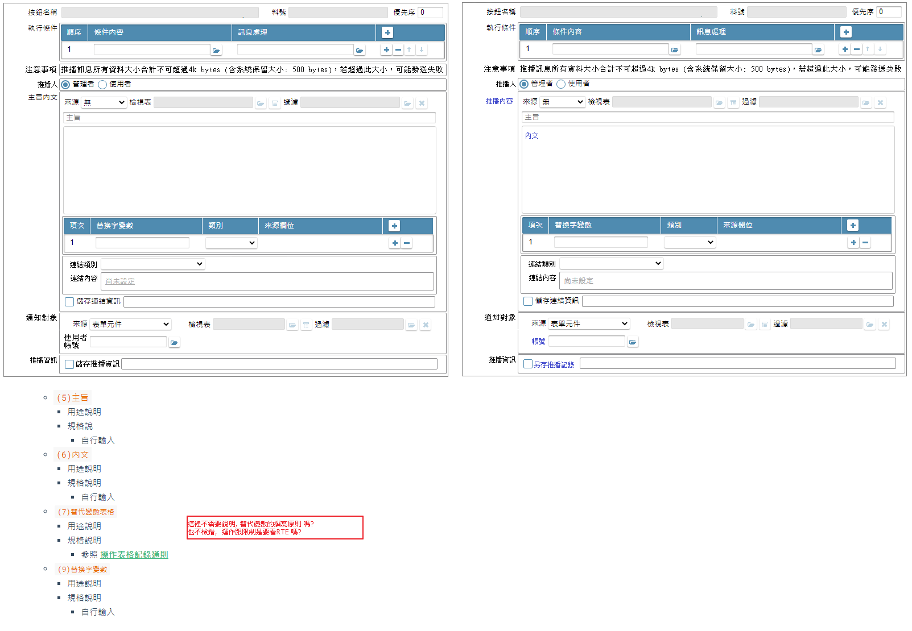
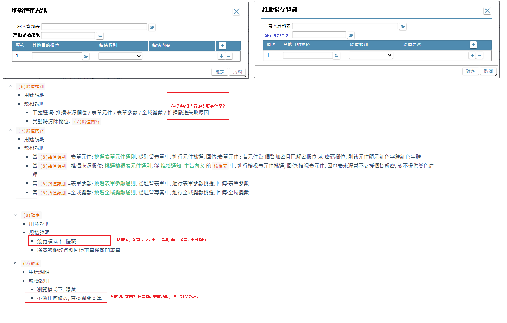
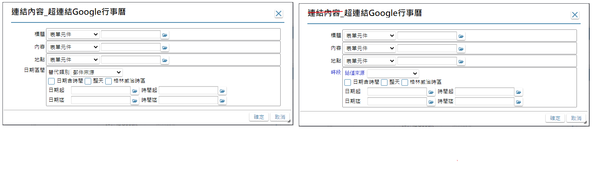
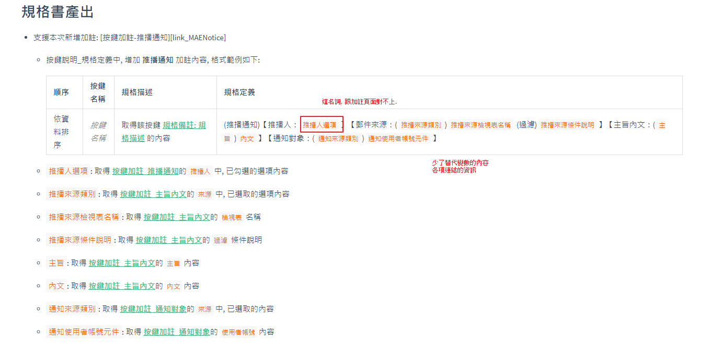

# 需求項目名稱 
##### 推播通知

# 版本資訊

|日期|版本|
|:-:|:-:|
|2020/11/18|v2|

# 變更內容
1. 替代變數規則、檢錯規則以及相關運作與限制規格如何查看？

2. [推播發送結果]改為[儲存結果欄位]

3. (7)遺漏推播通知發送原因規格說明

4. 介面規格相關
    * 應統一瀏覽狀態應該是不可編輯
    * 當編輯狀態時，如果有異動跳離或關閉應該警示

5. 補上[用途說明]

6. [連結內容_超連結表單]改為[超連結表單]

7. [連結內容_超連Google行事曆]改為[超連Google行事曆]

8. [日期區間]改為[時段]

9. [替代類別]改為[給值來源]

10. [推播人選項]名詞與規格內容對不上、替代變數各連結規格內容
