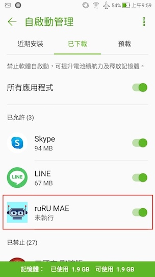

#### 
功能項目名稱

  * 推播通知

#### 
規劃人員

  * Andy

#### 
版本記錄

  |日期|版本|備註|
  |---|---|---|
  |2020/11/06|v1|初始化|

#### 
TRAC

  * [#8191](http://trac.uneec.com/trac/neco/ticket/8191)

#### 
規格說明

  * 需求展開
    * [APP ICON Badge](notification_icon.md)
      * 當有未讀訊息時顯示小圓點在APP ICON的右上方
    * [系統管理](notification_system.md)
      * 利用firebase的推播功能來通知使用者
      * 背景通知
        * 在逹成以下條件後，使用者可在未開啟MAE時接收到通知訊息
          1. 安裝MAE
          2. 使用者第一次登入
          3. 設定成主要裝置
      * 主裝置設定
        * 設定主裝置
        * 設定主裝置說明
        * 登入時不再詢問
    * [打樣](notification_prototyping.md)
      * 主裝置設定
        * 登入時不再詢問
        * 設定主裝置
    * [表單連結](notification_formlink.md)
      * 依設計者設定可開啟特定表單
    * [按鍵連結](notification_buttonlink.md)
      * 依設計者設定可執行特定表單的按鍵
    * [超連結](notification_hyperlink.md)
      * 依設計者設定可開啟特定網頁(含 google 行事曆)
    * [推播記錄](notification_record.md)
      * 使用者可以查看所有使用者的推播歷史記錄
    * [推播訊息](notification_message.md)
      * 使用者可以查看查看詳細訊息並可以執行相對應連結
    * [按鍵加註](notification_buttonlink.md)
      * 點擊按鍵後依加註來傳送通知

#### 
附件

  * 注意事項
    * 裝置唯一號 firebase token
      * 用來記錄裝置未重覆
      * 用來發送推播通知到特定裝置
      * 需連線網路才能取得
    
    <!--* 裝置唯一號 IMEI
      * 用來記錄裝置未重覆
      * 只有能安插ＳＩＭ卡的裝置才有
      * WIFI版處理方式
        * IOS 使用 identifier，APP移除後會被再安裝會取到不同的唯一碼，因此會視為不同裝置
        * Android 使用 mar address，必需要取得網路授權且必需要連接wifi後才能取得 -->
    * APP通知
      * APP圖示
        * 會依裝置、系統版本會有不同顯示(顯示未讀數量或小圓點)
          * Android 8 以上支援通知小圓點，但部份廠商的裝置未支援
            * 在有未讀的訊息時，移除系統通知列中的通知，APP通知圖示會被系統清除
          * IOS 2.0 以上支援未讀數量
      * APP在背景
        * APP未收到通知時可以先確認是否有在背景執行
        * 確認範例
          * 裝置：ASUS ZenFone 3 ZE552KL
          * Android 版本：8.0.0
          * 
Step 1: 開啟所有應該程式頁面 - 桌面往上滑

          * 
Step 2: 搜查設定 - 點擊查尋功能

          
            
          * 
Step 3: 搜查設定 - 點擊查尋功能

          
            
          * 
Step 4: 設定 - 點擊"應用程式與通知"

          
            
          * 
Step 5: 應用程式與通知 - 點擊"應用程式資訊"

          
            
          * 
Step 6: 應用程式資訊 - 點擊"ruRU MAE"

          
            
          * 
Step 7-1: 應用程式資訊 ruRU MAE - 背景已執行

          
            
          * 
Step 7-2: 應用程式資訊 ruRU MAE - 背景未執行

          
            
      * APP未執行
        * 部份裝置若有電源管理設定，需手動設定APP為自啟動，否則在APP未執行時無法接收到通知
        * 設定範例：
          * 裝置：ASUS ZenFone 3 ZE552KL
          * Android 版本：8.0.0
          * 
Step 1: 開啟所有應該程式頁面 - 桌面往上滑

          * 
Step 2: 搜查電源管理程式 - 點擊查尋功能

          
            
          * 
Step 3: 查找並開啟 - 智能管家

          
            
          * 
Step 4: 打開電力設定 - 電力逹人

          
            
          * 
Step 5: 打開自啟動設定 - 自啟動管理

            
          * 
Step 6: 開啟APP的自啟動 - ruRU MAE

            
    * "登入是否詢問"只保留在裝置上，所以打樣不另外設定，此為共用設定，清除APP暫存或刪除APP時會被清除
  * 限制
    * 裝置
      * Android：6.0 或更高版本
      * iOS：9.0 或更高版本
<!--  * 大小 * 所有資訊合計不可超過4k bytes -->
