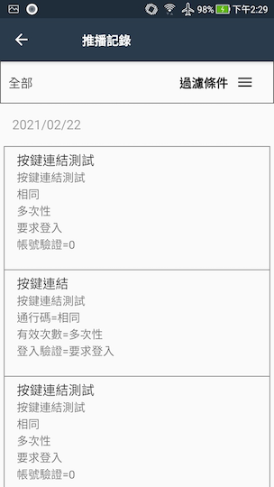
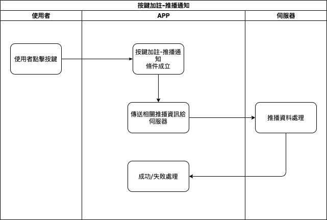

# 
MAE擴增推播通知

## 
規劃人員

    Andy

## 
規劃日期

    2020/11/06

## 
TRAC

    #8191

### 
推播通知

* 目的說明
  * 利用firebase的推播功能來通知使用者使用下列功能
    1. 開單連結
    2. 超連結(含 google 行事曆)
    3. 文字訊息
  * 增加推播記錄，方便使用者可以查看歷史記錄
* 限制
  * 裝置
    * Android：5.0 或更高版本
    * iOS：10.0 或更高版本
  * 大小
    * 所有資訊合計不可超過4k bytes

#### 
系統管理<path>(推播通知)</path>

* 擴充
* 規格說明
    * 裝置在背景/前景或未開啟的狀態下可接收系統收到的通知
    * 在點擊系統通知時處理相對應功能
      1. 開單連結
        * 開啟對應表單(需登入)
      2. 超連結(含 google 行事曆)
        * 開啟對應網址(google 行事曆需登入 google 帳號)
      4. 文字訊息
        * 顯示通知內容
* 通知畫面(系統)
  * Android

    
  
  * iOS
  
    

* 畫面說明
  * 標題(藍色框表示)：顯示通知的標題。
    * 超過長度則顯示省略符號...
      * ios約34個字以上
      * android約41個字以上
      * 實際長度依裝置不同會有不同字數
  * 內容(紅色框表示)：顯示通知的內容。
    * 超過長度則顯示省略符號...
      * ios約147個字以上
      * android
        * 未展開約43個字以上
        * 展開約611個字以上
      * 實際長度依裝置不同會有不同字數
  * 點擊：點擊系統通知會呼叫MAE APP，APP啟動後會依通知類型來處理相對應事件。

* 作業流程

  

#### 
表單連結<path>(推播通知)</path>

* 異動
* 規格說明
  * 以推播資料所包含的唯一號，和伺服器取得表單資訊，再經過驗證使用者無誤後，開啟相關表單
* 表單畫面：無
* 作業流程
  

#### 
超連結<path>(推播通知)</path>

* 異動
* 規格說明
  * 以推播資料所包含的網址，轉導至瀏覧器開啟網頁
* 表單畫面：無
* 作業流程

  

#### 
推播記錄<path>(推播通知)</path>

* 異動
* 規格說明
  * 系統新增功能
  * 畫面欄位顯示日期/標題/內文/狀態/選取(已讀)
  * 功能
    * 點擊
      * 範圍：日期/標題/內文/狀態
        * 執行相關動作且改為已讀
      * 範圍：選取
        * 多選模式
  * 過濾資料(可以日期區間/已讀/未讀來過濾記錄)
* 表單畫面(設計)
  * 推播記錄
  
    
  * 過濾條件<path>推播記錄</path>
  
    

* 作業流程

  

#### 
推播通知<path>(按鍵加註)</path>

* 異動
* 規格說明
    * 按鍵加註擴充功能
    * 將依設計者設定而使用者決定的資料傳給伺服器，再由伺服器回傳結果
* 表單畫面：無
* 作業流程

  

