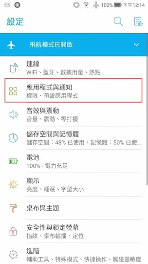
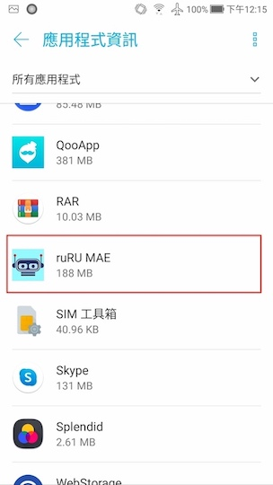
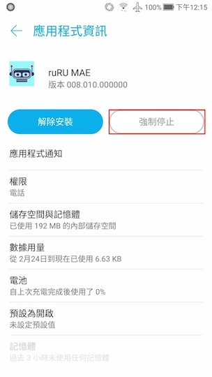
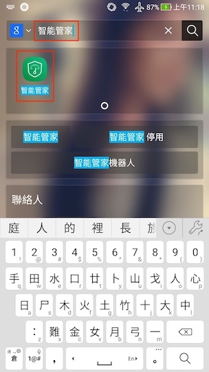
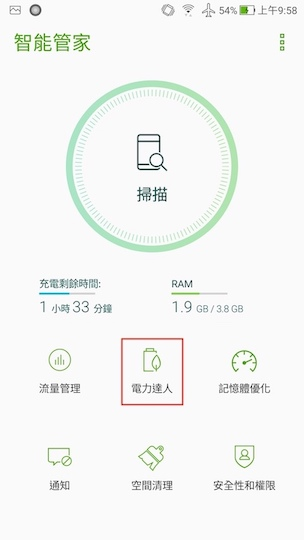

#### 功能項目名稱
  * 
推播通知問題需知

#### 
規劃人員

  * Andy

#### 
版本記錄

  |日期|版本|備註|
  |---|---|---|
  |2021/02/26|v1|初始化|

#### 
問題說明

  * 問題 1：APP安裝完後無法收到通知
    * APP在安裝完後需要先執行過一次，且需要正常登入後才能接到通知
  * 問題 2：APP在背景時無法收到通知
    * APP未收到通知時可以先確認是否有在背景執行
      * 確認範例
        * 裝置：ASUS ZenFone 3 ZE552KL
        * Android 版本：8.0.0
        * 
Step 1: 開啟所有應該程式頁面 - 桌面往上滑

        
        * 
Step 2: 搜查設定 - 點擊查尋功能

          
          
        * 
Step 3: 搜查設定 - 點擊查尋功能

          
          
        * 
Step 4: 設定 - 點擊"應用程式與通知"

          
          
        * 
Step 5: 應用程式與通知 - 點擊"應用程式資訊"

          
          
        * 
Step 6: 應用程式資訊 - 點擊"ruRU MAE"

          
          
        * 
Step 7: 應用程式資訊 ruRU MAE - 背景已執行

          
          
          * 
背景未執行時會無法接收通知

          
            
  * 問題 3：APP未執行時無法收到通知
    * 部份裝置若有電源管理設定，需手動設定APP為自啟動，否則在APP未執行時無法接收到通知
    * 設定範例：
      * 裝置：ASUS ZenFone 3 ZE552KL
      * Android 版本：8.0.0
      * 
Step 1: 開啟所有應該程式頁面 - 桌面往上滑

      * 
Step 2: 搜查電源管理程式 - 點擊查尋功能

          
        
      * 
Step 3: 查找並開啟 - 智能管家

          
        
      * 
Step 4: 打開電力設定 - 電力逹人

          
        
      * 
Step 5: 打開自啟動設定 - 自啟動管理

        
      * 
Step 6: 開啟APP的自啟動 - ruRU MAE

        

