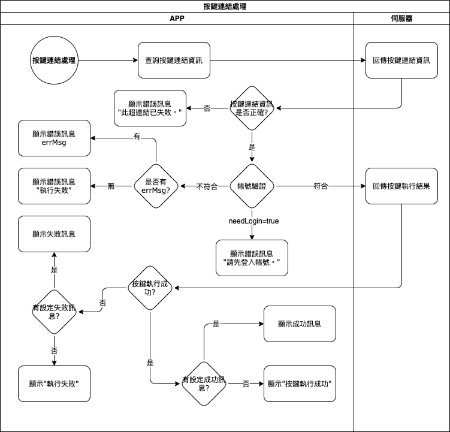

#### 
功能項目名稱

  * 按鍵連結

## 
規劃人員

  * Andy

#### 
版本記錄

  |日期|版本|備註|
  |---|---|---|
  |2020/11/06|v1|初始化|

## 
TRAC

  * [#8191](http://trac.uneec.com/trac/neco/ticket/8191)

#### 
規格說明

  * 以推播資料所包含的唯一號，和伺服器取得按鍵資訊，再經過驗證使用者無誤後，呼叫相關API取得結果並顯示

#### 
作業流程

  
