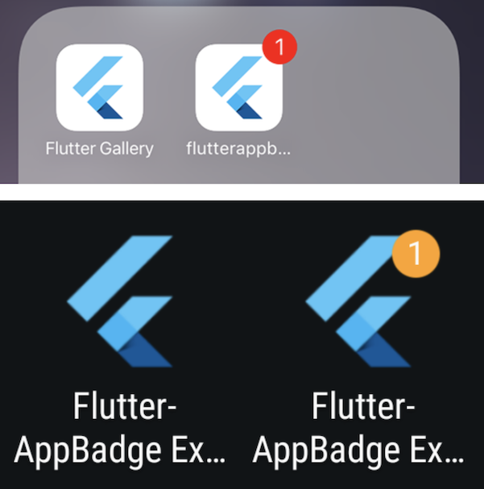
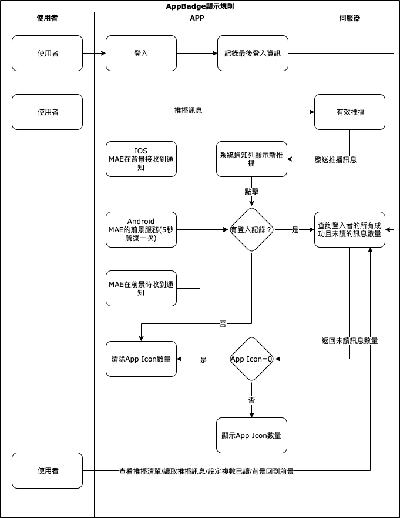

#### 
功能項目名稱

  * APP ICON Badge

## 
規劃人員

  * Andy

#### 
版本記錄

  |日期|版本|備註|
  |---|---|---|
  |2020/11/06|v1|初始化|

## 
TRAC

  * [#8191](http://trac.uneec.com/trac/neco/ticket/8191)

#### 
規格說明

  * 當有通知時，顯示小圓點在APP ICON右上方
  * 當裝置有支援時可以顯示未讀數量

#### 
畫面

  * 示意圖

    

#### 
作業流程

  

#### 
附件

  * 注意事項
    * APP通知圖示會依裝置、系統版本會有不同顯示

