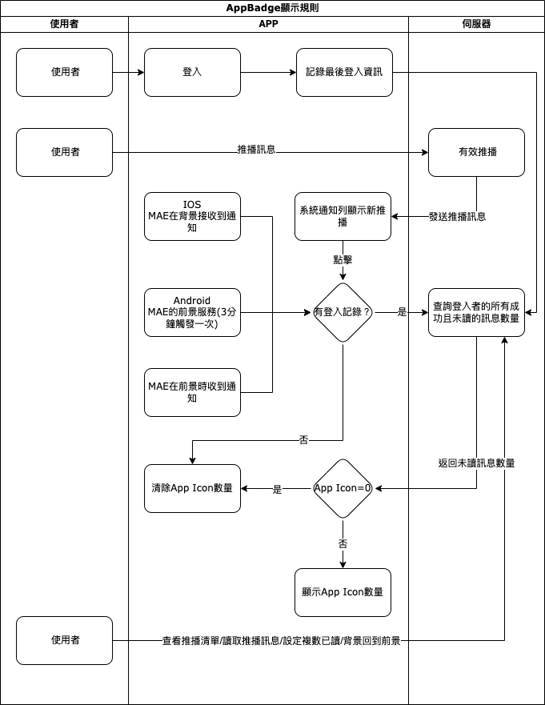

#### 
功能項目名稱

  * APP ICON Badge

## 
規劃人員

  * Andy

#### 
版本記錄

  |日期|版本|備註|
  |---|---|---|
  |2020/11/06|v1|初始化|

## 
TRAC

  * [#8191](http://trac.uneec.com/trac/neco/ticket/8191)

#### 
規格說明

  * 限制
    * 當裝置有支援時才可以顯示未讀數量在APP ICON右上方
    * Android
      * Android 8 之後可以選擇顯示小圓點或是顯示數字
        * 部份機型僅可顯示小圓點(Asus Zenfone系列)
    * IOS
      * MAE在前景時，通知列的通知的保留有時間限制
    * 當伺服器(8.10.0含以上)有支援通知功能時，MAE即可支援通知
  * 查詢條件
    * 推播通知數量查詢條件為最後一位登入的使用者的未讀且成功的訊息數量
  * 刷新時機
    * 使用者登入時
    * 背景回到前景時
    * 點擊通知列通知時
    * 點擊MAE的系統通知列表中的資訊時
    * 刷新MAE的系統通知列表時
    * 設定通知資訊為已讀時
    * IOS
      * 收到推播通知時
    * Android
      * 通知列常駐通知服務，每5秒會觸發一次來更新推播通知數量

#### 
畫面

  * 示意圖

    

#### 
作業流程

  

#### 
附件

  * [注意事項](Warning.md)

