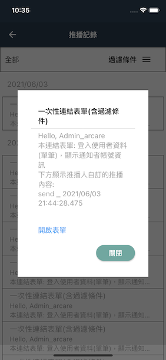
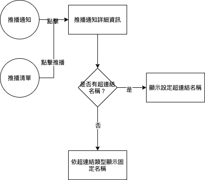

#### 
功能項目名稱

  * 推播功能 超連結文字變更

## 
規劃人員

  * Andy

#### 
版本記錄

  |日期|版本|備註|
  |---|---|---|
  |2021/06/22|v1|初始化|

## 
TRAC

  * [#8533](http://trac.uneec.com/trac/neco/ticket/8533)

#### 
規格說明

  * 推播功能_超連結變更文字
    * [IDE設定](../IDE/BAMAENotice.md#fieldbreak3)
      * [第15項 顯示名稱](../IDE/BAMAENotice.md#link_show_name)

#### 
畫面

  * 示意圖

    

#### 
作業流程

  

<!--#### 
附件

  * [注意事項](Warning.md) -->

