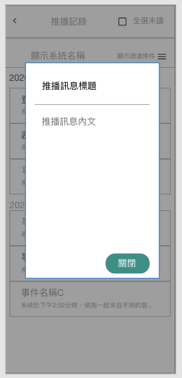

## 
規劃人員

  * Andy

## 
規劃日期

  * 2020/11/06

## 
TRAC

  * 待補

#### [
推播通知.推播訊息<path>(首頁)</path>
](README.md)
* 規格說明
  * 推播訊息顯示
  * 功能
    * 點擊關閉
      * 關閉訊息
    * 點擊遮罩處
      * 關閉訊息
    * 點擊內文超連結(執行按鍵/加入行事曆/內含連結/開啟表單)
      * 啟動超連結(含google行事曆連結)/表單連結/按鍵連結
* 表單畫面
    
    
