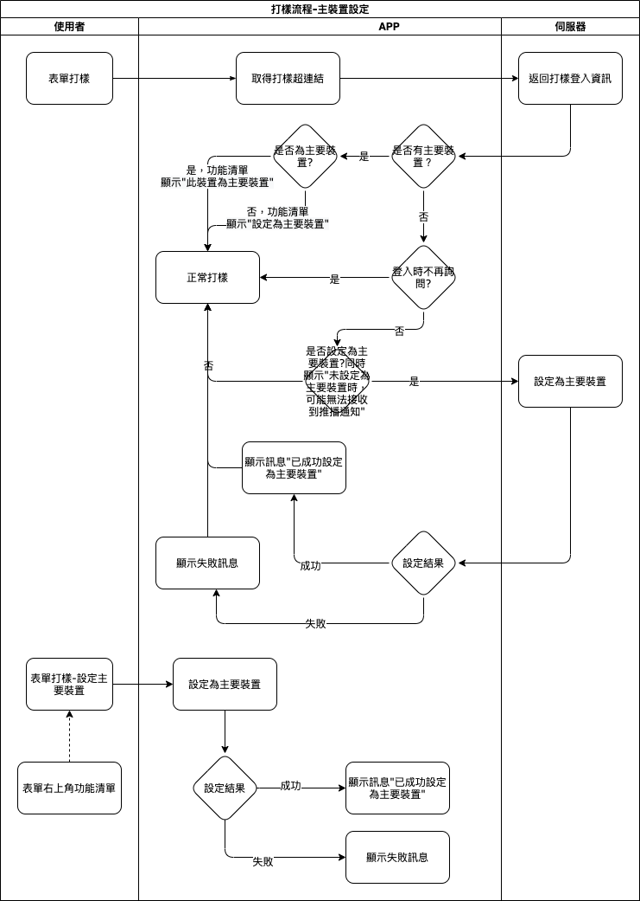

#### 
功能項目名稱

  * 打樣

#### 
規劃人員

  * Andy

#### 
版本記錄

  |日期|版本|備註|
  |---|---|---|
  |2021/01/30|v1|初始化|

#### 
TRAC

  * [#8191](http://trac.uneec.com/trac/neco/ticket/8191)

#### 
規格說明

  * 需求展開
    * 主裝置設定
      * 登入判斷
        * 打樣登入時會判斷是否有設定主裝置，若否會依"登入是否詢問"來詢問是否設定主裝置
      * 系統導航列選單功能項
        * 可主動設定該裝置為主裝置

#### 
作業流程

  

#### 
附件

  * [注意事項](Warning.md)

