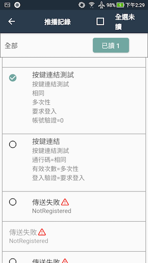
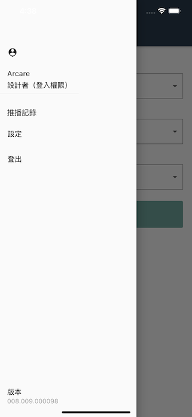

#### 
功能項目名稱

  * 推播記錄

#### 
規劃人員

  * Andy

#### 
版本記錄

  |日期|版本|備註|
  |---|---|---|
  |2020/11/06|v1|初始化|

#### 
TRAC

  * [#8191](http://trac.uneec.com/trac/neco/ticket/8191)

#### 
規格說明

  * 列入系統功能
  * 畫面顯示[(表單畫面 推播記錄)](#image_record)
    * 上方工具列
      * 功能名稱
      * 全選
    * 過濾條件
      * 顯示目前選擇的系統過濾條件
      * 進階過濾條件
    * 訊息清單
  * 讀取狀態[(表單畫面 推播記錄)](#image_record)
    * 已讀：淺色顯示
    * 未讀：深色顯示
  * 傳送狀態[(表單畫面 推播記錄)](#image_record)
    * 失敗
      * 已讀：淺紅色透通顯示
      * 未讀：深紅色透通顯示
  * 功能
    * 上方工具列
      * 全選[(表單畫面 推播記錄)](#image_record)
        * 勾選全部未讀訊息並進入多選模式
        * 過濾條件處顯示全部已讀按鈕
          * 點擊後修改已勾選訊息的狀態為已讀
        * 全選未讀改為取消全選[(表單畫面 選取模式)](#image_selected)
    * 過濾條件[( 表單畫面 過濾條件 )](#image_filter)
      * 顯示/收起 可設定的過濾條件
        * 系統：全部(預設)/系統清單
        * 發送人：全部(預設)/發送人清單
        * 傳送狀態：全部(預設)/成功/失敗
        * 讀取狀態：全部/已讀(預設)/未讀
        * 日期區間：預設(不限制)/自訂
      * 確認
        * 依當下所選的過濾條件顯示訊息記錄
    * [動作](#workflow)
      * 點擊
        * 查看訊息內文
      * 長按(未讀訊息)
        * 勾選未讀訊息並進入多選模式

#### 
畫面

  * 表單畫面
    * 
推播記錄

    
      

    * 
選取模式

    
      
    * 
過濾條件

    
      
  
  * 系統推播記錄查看功能

    

#### 
作業流程

  
