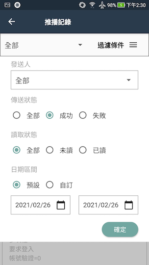
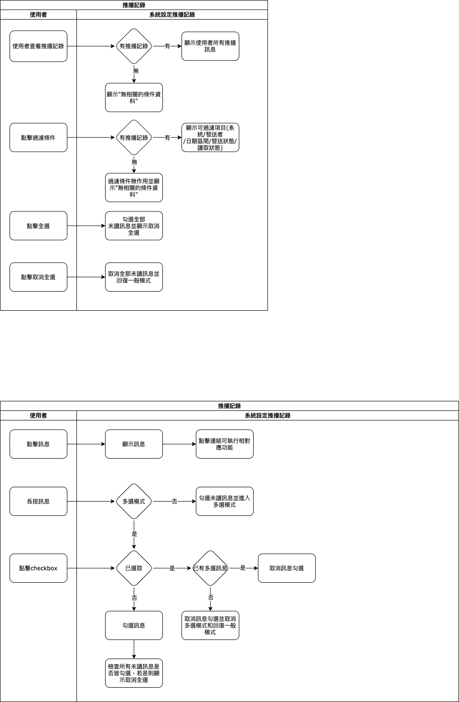

## 
規劃人員

  * Andy

## 
規劃日期

  * 2020/11/06

## 
TRAC

  * 待補

#### [
推播通知.推播記錄<path>(首頁)</path>
](README.md)
* 異動
* 規格說明
  * 系統功能
  * 畫面顯示
    * 上方工具列
      * 功能名稱
      * 全選未讀
    * 過濾條件
      * 顯示目前選擇的系統過濾條件
      * 進階過濾條件
    * 訊息清單
  * 狀態
    * 已讀：淺色顯示
    * 未讀：深色顯示
  * 功能
    * 上方工具列
      * 全選未讀
        * 勾選全部未讀訊息並進入多選模式
        * 過濾條件處顯示全部已讀按鈕
          * 點擊後修改已勾選訊息的狀態為已讀
        * 全選未讀改為取消全選
    * 過濾條件
      * 顯示/收起 可設定的過濾條件
        * 系統：全部/系統清單
        * 發送人：全部/發送人清單
        * 狀態：全部/已讀/未讀
        * 日期區間：預設(不限制)/自訂
      * 確認
        * 依當下所選的過濾條件顯示訊息記錄
* 表單畫面
  * 推播記錄
  
    
  * 過濾條件<path>推播記錄</path>
  
    

* 作業流程

  
