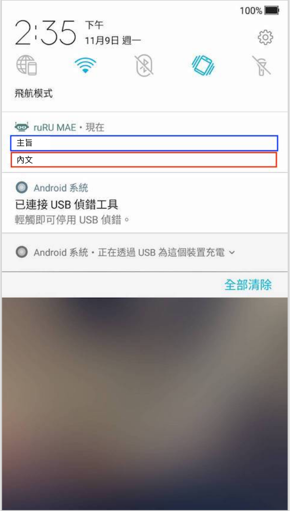
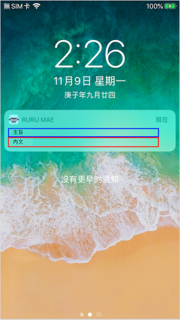
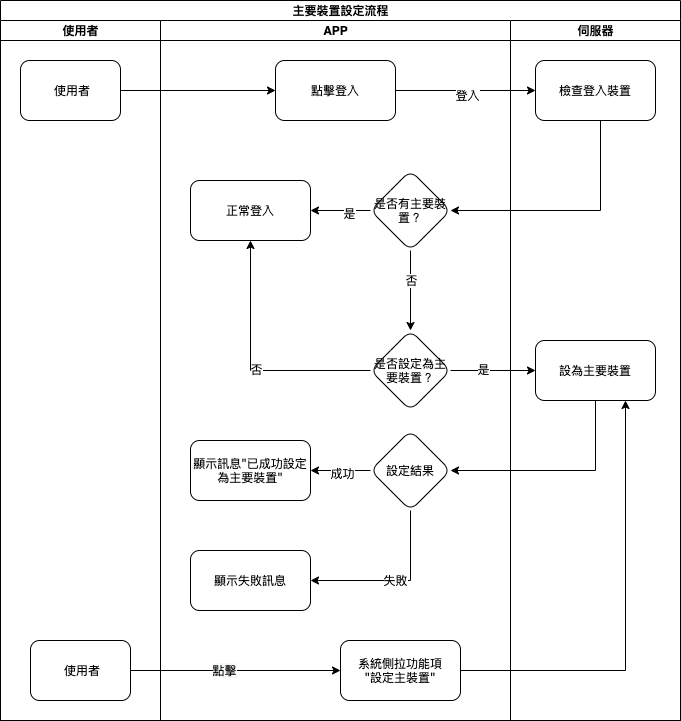
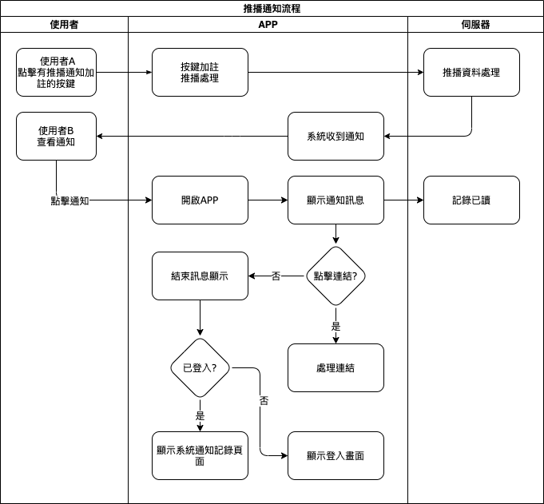

#### 
功能項目名稱

  * 系統管理

#### 
規劃人員

  * Andy

#### 
版本記錄

  |日期|版本|備註|
  |---|---|---|
  |2020/11/06|v1|初始化|

#### 
TRAC

  * [#8191](http://trac.uneec.com/trac/neco/ticket/8191)

#### 
規格說明

  * 需求展開
    * 設定主要裝置
      * 可將目前登入的裝置設定為主要裝置
    * 裝置在背景/前景或未開啟的狀態下(主要裝置)可接收系統收到的通知
    * 在點擊系統通知時處理相對應功能
      1. [表單連結](notification_formlink.md)
        * 開啟對應表單(需登入)
      2. [按鍵連結](notification_buttonlink.md)
        * 執行特定表單的按鍵功能
      3. [超連結](notification_hyperlink.md)
        * 開啟對應網址
        * 連結 google 行事曆(需登入 google 帳號)
      4. [推播記錄](notification_record.md)
        * 顯示所有推播訊息
      5. [推播訊息](notification_message.md)
        * 顯示推播訊息

#### 
畫面

* 通知畫面(系統)
  * Android

    
  
  * iOS
  
    

* 畫面說明
  * 主旨(藍色框表示)：通知的主旨。
    * 超過長度則顯示省略符號...
      * ios約34個字以上
      * android約41個字以上
      * 實際長度依裝置不同會有不同字數
  * 內文(紅色框表示)：通知的內容。
    * 超過長度則顯示省略符號...
      * ios約147個字以上
      * android
        * 未展開約43個字以上
        * 展開約611個字以上
      * 實際長度依裝置不同會有不同字數
  * 點擊
    * 點擊系統通知會呼叫MAE APP，APP啟動後會顯[推播通知訊息](notification_message.md)，點擊連結會開啟相對應連結。

#### 
作業流程

  * 主要裝置設定
  
    

  * 推播通知設定
    
