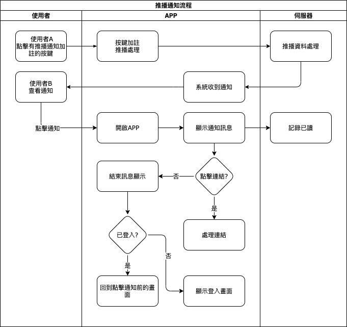

## 
規劃人員

  * Andy

## 
規劃日期

  * 2020/11/06

## 
TRAC

  * 待補

#### 
系統管理<path>(推播通知)</path>

* 擴充
* 規格說明
    * 裝置在背景/前景或未開啟的狀態下可接收系統收到的通知
    * 在點擊系統通知時處理相對應功能
      1. 開單連結
        * 開啟對應表單(需登入)
      2. 超連結(含 google 行事曆)
        * 開啟對應網址(google 行事曆需登入 google 帳號)
      4. 文字訊息
        * 顯示通知內容
* 通知畫面(系統)
  * Android

    
  
  * iOS
  
    

* 畫面說明
  * 標題(藍色框表示)：顯示通知的標題。
    * 超過長度則顯示省略符號...
      * ios約34個字以上
      * android約41個字以上
      * 實際長度依裝置不同會有不同字數
  * 內容(紅色框表示)：顯示通知的內容。
    * 超過長度則顯示省略符號...
      * ios約147個字以上
      * android
        * 未展開約43個字以上
        * 展開約611個字以上
      * 實際長度依裝置不同會有不同字數
  * 點擊：點擊系統通知會呼叫MAE APP，APP啟動後會依通知類型來處理相對應事件。

* 作業流程

  
