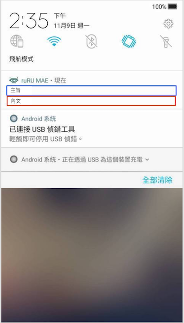
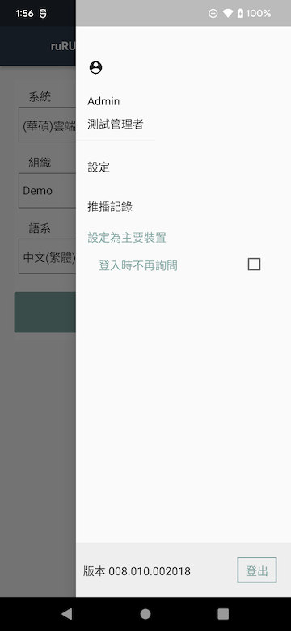
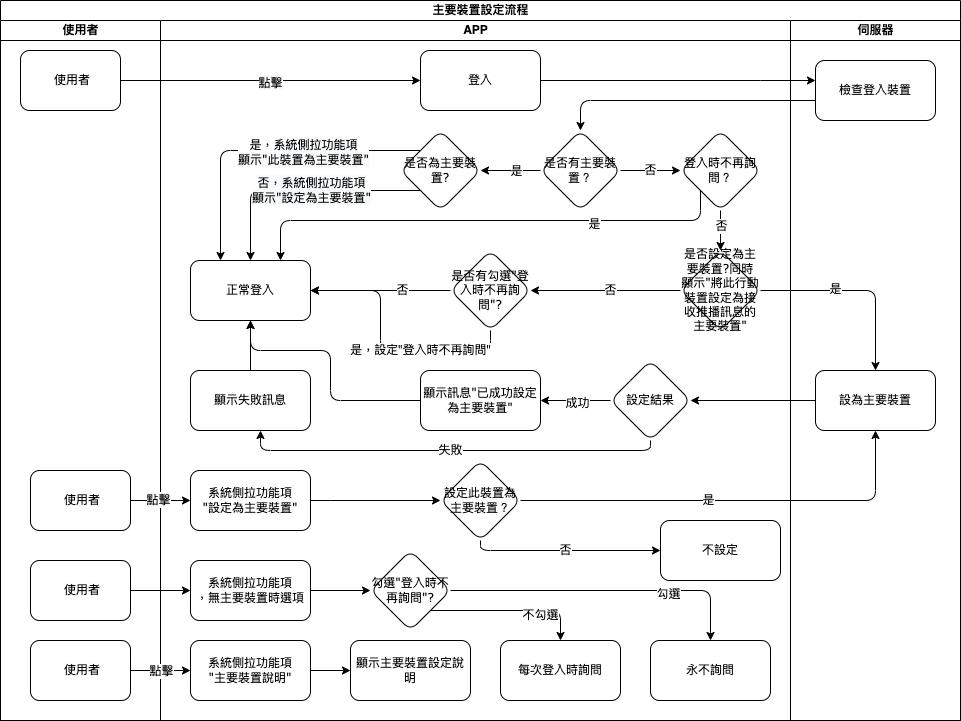

#### 
功能項目名稱

  * 系統管理

#### 
規劃人員

  * Andy

#### 
版本記錄

  |日期|版本|備註|
  |---|---|---|
  |2020/11/06|v1|初始化|

#### 
TRAC

  * [#8191](http://trac.uneec.com/trac/neco/ticket/8191)

#### 
規格說明

  * 需求展開
    * 主裝置設定
      * 登入判斷
        * 登入時判斷是否有設定主裝置，若否則依"登入不再詢問"狀態來決定是否要詢問設定為主裝置
      * 系統側拉選單功能項
        * 可主動設定該裝置為主裝置
        * 主裝置設定說明
        * 登入時不再詢問（打樣時同時參考此設定）
          * 在登入時依此設定來決定是否詢問是否要設定主要裝置
          
          <!--* 在帳號未設定主裝置時才可設定，若已有設定主裝置時，此狀態不可改變-->
    * 推播通知([推播通知問題需知](device_setting.md))
      * 裝置在背景/前景或未開啟的狀態下(主要裝置)可接收系統收到的通知
    * 在點擊系統通知時處理相對應功能
      1. [表單連結](notification_formlink.md)
        * 依設計者設定可開啟特定表單
      2. [按鍵連結](notification_buttonlink.md)
        * 依設計者設定可執行特定表單的按鍵
      3. [超連結](notification_hyperlink.md)
        * 依設計者設定可開啟特定網頁(含 google 行事曆)
      4. [推播記錄](notification_record.md)
        * 使用者可以查看所有使用者的推播歷史記錄
      5. [推播訊息](notification_message.md)
        * 使用者可以查看查看詳細訊息並可以執行相對應連結

#### 
畫面

  * 通知畫面(系統)
    * Android

      
    
    * iOS
    
      

    * 畫面說明
      * 主旨(藍色框表示)：通知的主旨。
        * 超過長度則顯示省略符號...
          * ios約34個字以上
          * android約41個字以上
          * 實際長度依裝置不同會有不同字數
      * 內文(紅色框表示)：通知的內容。
        * 超過長度則顯示省略符號...
          * ios約147個字以上
          * android
            * 未展開約43個字以上
            * 展開約611個字以上
          * 實際長度依裝置不同會有不同字數
      * 點擊
        * 點擊系統通知會呼叫MAE APP，APP啟動後會直接顯示[推播通知訊息](notification_message.md)，點擊連結會開啟相對應連結。

  * 主要裝置設定/登入時不再詢問

    

#### 
作業流程

  * 主要裝置設定
  
    

  * 推播通知設定
    

#### 
附件

  * [注意事項](Warning.md)