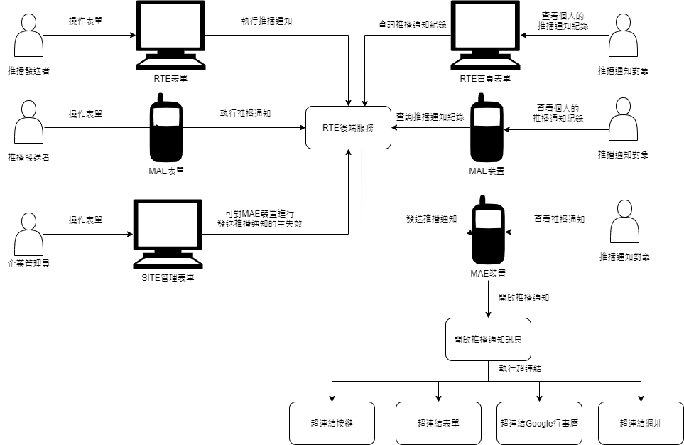

# MAE擴增推播通知功能

### 
需求功能

### 
需求說明

* 推播通知內容支援
    * 純文字訊息通知
    * 超連結開啟MAE表單
    * 超連結執行功能按鍵
    * 超連結以瀏覽器開啟Google行事曆
    * 超連結以瀏覽器開啟指定網址
* 企業管理者可以從SITE管理表單，強制指定特定裝置不予傳送訊息。
* 使用者從MAE設定主要裝置、無須再次驗證身分即可指定該裝置為主要裝置。
* 訊息只傳送使用者設定為主要裝置以及登入中的MAE共用行動裝置。
* 共用裝置只有登入中使用者可以接收訊息，後者登入覆蓋前者，所有登入中未設定為主要裝置的MAE行動裝置均視為共用裝置。
* 使用者如果未設定主要裝置，登入裝置時跳出詢問視窗確認是否設為主要裝置，該功能強制通知。
* 每一台裝置只能有一個使用者設定為主要裝置，採後者設定覆蓋前者。
* 每一位使用者僅能設定一個主要裝置，採後者設定覆蓋前者。
* 每一位使用者僅記錄連結一台登入中共用裝置。
* 發送過的訊息紀錄可以由使用者在登入MAE後、於MAE【紀錄查詢】的【系統表單】中查詢訊息狀態並執行未讀訊息後續未完成的作業（無須選擇應用系統即可讀取所有屬於該帳戶的跨系統訊息）。
* 發送過的訊息紀錄可以由使用者在登入RTE後、於個人資料中查詢訊息紀錄，但不能執行訊息內超連結功能。
* 登入後自動通知是否有未讀訊息，該自動檢查功能強制檢查。
* 登出MAE時清除本機推播訊息紀錄。
* 提供排程預約發送訊息。
* 一個裝置只會存在有一種狀態、為主要裝置或共用裝置其中一種，於裝置中一旦被指定為主要裝置就無法成為共用裝置。
* 排程清除發送日期超過30天的通播通知。