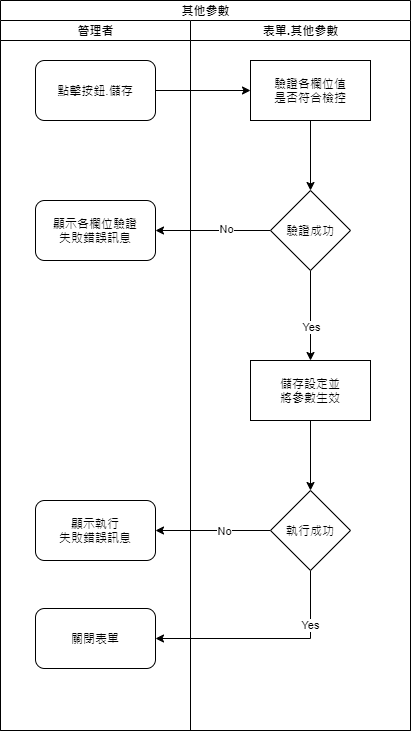

### 
規劃人員

* 正傑

### 
規劃日期

* 2020/11/04

### 
TRAC

* #8192

### 
表單.推播通知管理 <path>(Site管理)</path>

* 擴充
* 規格說明
    * 該表單用來管理使用者接收推播通知的能力
    * 該表單僅系統管理員或企業管理員權限可開啟
    * 若為系統管理員，表單開啟後，列出該系統管理員可管理的系統下所有使用者清單。 <ps>注意</ps> : 因同一使用者可能會在多個系統出現，需去除重複的使用者，同一使用者在清單中僅出現一筆。
    * 若為企業管理員，表單開啟後，列出該企業下所有使用者清單。
* 表單畫面

    
* 畫面規格說明
    * 欄位.部門單位 : 該使用者所屬的部門單位名稱
    * 欄位.帳號 : 該使用者的帳號
    * 欄位.使用者姓名 : 該使用者的姓名
    * 按鈕.生效 : 點擊後將該使用者接收推播通知的功能生效，若為已生效的使用者紀錄，該按鈕除能。
    * 按鈕.失效 : 點擊後將該使用者接收推播通知的功能失效，若為已失效的使用者紀錄，該按鈕除能。

* 作業流程
    * 開啟畫面

    
    * 生效使用者接收推播通知

    
    * 失效使用者接收推播通知

    

### 
表單.其他參數 <path>(Site管理)</path>

* 異動
* 規格說明
    * 增加推播訊息相關設定，用來管理推播訊息的保存時間。
    * 增加欄位.推播通知訊息保留天數，數字型態欄位，不可空白，不可輸入小於0的數字，若為0則不執行清除訊息，欄位預設值為30。
* 表單畫面

       
* 作業流程
    * 儲存

    
### 
推播訊息 <path>(Site管理)</path>

