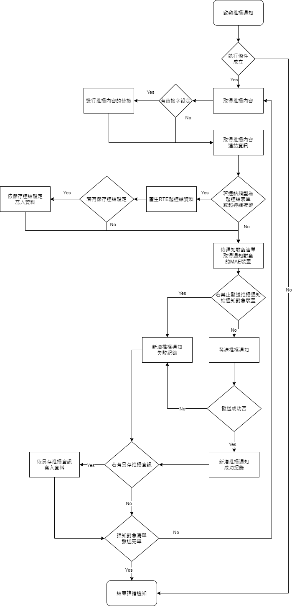

### 
規劃人員

* 正傑

### 
規劃日期

* 2020/11/09

### 
TRAC

* 待開

### 
作業流程

 
### 
推播通知 <path>(按鍵加註)</path>

發送推播通知給MAE

### 
執行條件 <path>(按鍵加註\推播通知)</path>

以`執行內容`的結果來決定是否要執行該推播通知

### 
執行內容 <path>(按鍵加註\推播通知\執行條件)</path>

若`執行內容`結果未通過，表示該推播通知不執行。

### 
訊息處理 <path>(按鍵加註\推播通知\執行條件)</path>

若`執行內容`結果未通過時需彈出的錯誤訊息。

### 
推播人 <path>(按鍵加註\推播通知)</path>

推播人類型
* `管理者` : 訊息推播時，顯示系統工具表單.系統參數設定中的推播通知區塊下的推播人名。
* `使用者` : 訊息推播時，顯示執行使用者名稱。

### 
主旨內文 <path>(按鍵加註\推播通知)</path>

推播通知的訊息標題以及內容，可在`主旨`以及`內文`中撰寫替換字，再設定`替代變數表格`，運行時會將內文進行替換的動作。

### 
來源 <path>(按鍵加註\推播通知\主旨內文)</path>

是否需查表，共有以下類型 : 
* `無` : 表示內文無資料來源可供查詢或替換。
* `查表` : 表示內文可依據`檢視表`加上`過濾`後的結果查詢到資料，用來做替換字來源用。

### 
檢視表 <path>(按鍵加註\推播通知\主旨內文)</path>

`內文`可指定的資料來源

### 
過濾 <path>(按鍵加註\推播通知\主旨內文)</path>

`檢視表`可指定的過濾條件

### 
主旨 <path>(按鍵加註\推播通知\主旨內文)</path>

紀錄推播通知的標題，可在此寫訊息標題，若有需要進行替換字處理，可填寫`替代變數表格`進行替換。

### 
內文 <path>(按鍵加註\推播通知\主旨內文)</path>

紀錄推播通知的內容，可在此寫訊息內容，若有需要進行替換字處理，可填寫`替代變數表格`進行替換。

### 
替代變數表格 <path>(按鍵加註\推播通知\主旨內文)</path>

紀錄推播通知針對`主旨`以及`內文`的替換字清單。

如 : `內文`中有%AAA，`替換字變數`也有一個變數叫做AAA，運行時就會將此筆資料的`來源欄位`內容替換掉內文的%AAA。

### 
替換字變數 <path>(按鍵加註\推播通知\主旨內文\替代變數表格)</path>

紀錄推播通知的替換字變數名稱。

### 
類別 <path>(按鍵加註\推播通知\主旨內文\替代變數表格)</path>

替換字變數的替換類別，共有以下幾種 :
* `推播來源欄位`
* `表單元件`
* `表單參數`
* `全域變數`
* `通知來源欄位`
* `推播人`

### 
來源欄位 <path>(按鍵加註\推播通知\主旨內文\替代變數表格)</path>

替換字變數的替換值
* 依照`類別`
    * `推播來源欄位` : `主旨內文`資料來源的欄位值。
    * `表單元件` : `表單元件` / `隱藏表單元件`。
    * `表單參數` : `表單`的`接收參數`。
    * `全域變數` : 系統`全域變數`。
    * `通知來源欄位` : `通知對象`資料來源的欄位值。

### 
連結類別 <path>(按鍵加註\推播通知\主旨內文)</path>

推播通知超連結的類型，共有以下幾種 :
* `超連結表單` : 點擊後開啟一張指定的MAE表單
* `超連結按鍵` : 點擊後執行一個指定的功能按鍵
* `超連結Google行事曆` : 點擊後開啟Google行事曆網頁
* `超連結網址` : 點擊後開啟網頁網址

### 
連結內容 <path>(按鍵加註\推播通知\主旨內文)</path>

超連結內容資訊

### 
超連結表單 <path>(按鍵加註\推播通知\主旨內文\連結內容)</path>

點擊推播通知時，開啟一張MAE表單。

### 
表單名稱 <path>(按鍵加註\推播通知\主旨內文\連結內容\超連結表單)</path>

點擊推播通知時，要開啟的MAE表單。

### 
表單參數 <path>(按鍵加註\推播通知\主旨內文\連結內容\超連結表單)</path>

點擊推播通知時，開啟MAE表單時要傳入的參數。

### 
過濾 <path>(按鍵加註\推播通知\主旨內文\連結內容\超連結表單)</path>

點擊推播通知時，開啟MAE表單時要執行的過濾條件

### 
通行碼 <path>(按鍵加註\推播通知\主旨內文\連結內容\超連結表單)</path>

表示該超連結是否都用同一組通行碼
* `相同` : 表示不同使用者但共用同一組通行碼。
* `不相同` : 依照每位使用者產生不同通行碼，配合`有效次數`選擇`一次性`可做到每個使用者執行推播通知超連結後即失效，且不影響其他使用者。

### 
有效次數 <path>(按鍵加註\推播通知\主旨內文\連結內容\超連結表單)</path>

表示此推播通知的超連結可用次數 :
* `一次性` : 執行超連結一次後即失效。
* `多次性` : 可重複執行超連結多次。

### 
執行系統 <path>(按鍵加註\推播通知\主旨內文\連結內容\超連結表單)</path>

表示執行此超連結時是否需重新驗證帳號密碼
* `要求登入` : 執行超連結時需進行登入驗證。
    * `帳號驗證` : 驗證登入帳號是否與接收通知對應帳號相同。若使用者已登入，帳號不符合接收通知對應帳號，彈出錯誤訊息【您已經登入其它帳號，請先登出。】；若使用者未登入，且登入帳號不符合接收通知對應帳號，彈出錯誤訊息【您無權限執行此超連結。】
* `自動登入` : 執行超連結時以指定帳號自動登入，若使用者已登入，帳號不符合接收通知對應帳號，彈出錯誤訊息【您已經登入其它帳號，請先登出。】；若使用者未登入，使用指定帳號自動登入。

### 
超連結按鍵 <path>(按鍵加註\推播通知\主旨內文\連結內容)</path>

點擊推播通知時，執行一個指定的功能按鍵

### 
表單名稱 <path>(按鍵加註\推播通知\主旨內文\連結內容\超連結按鍵)</path>

要執行的功能按鍵所歸屬的表單

### 
按鍵名稱 <path>(按鍵加註\推播通知\主旨內文\連結內容\超連結按鍵)</path>

要執行的功能按鍵

### 
通行碼 <path>(按鍵加註\推播通知\主旨內文\連結內容\超連結按鍵)</path>

表示該超連結是否都用同一組通行碼
* `相同` : 表示不同使用者但共用同一組通行碼。
* `不相同` : 依照每位使用者產生不同通行碼，配合`有效次數`選擇`一次性`可做到每個使用者執行推播通知超連結後即失效，且不影響其他使用者。

### 
有效次數 <path>(按鍵加註\推播通知\主旨內文\連結內容\超連結按鍵)</path>

表示此推播通知的超連結可用次數 :
* `一次性` : 執行超連結一次後即失效。
* `多次性` : 可重複執行超連結多次。

### 
執行系統 <path>(按鍵加註\推播通知\主旨內文\連結內容\超連結按鍵)</path>

表示執行此超連結時是否需重新驗證帳號密碼
* `要求登入` : 執行超連結時需進行登入驗證。
    * `帳號驗證` : 驗證登入帳號是否與接收通知對應帳號相同。若使用者已登入，帳號不符合接收通知對應帳號，彈出錯誤訊息【您已經登入其它帳號，請先登出。】；若使用者未登入，且登入帳號不符合接收通知對應帳號，彈出錯誤訊息【您無權限執行此超連結。】
* `自動登入` : 執行超連結時以指定帳號自動登入，若使用者已登入，帳號不符合接收通知對應帳號，彈出錯誤訊息【您已經登入其它帳號，請先登出。】；若使用者未登入，使用指定帳號自動登入。

### 
執行後續 <path>(按鍵加註\推播通知\主旨內文\連結內容\超連結按鍵)</path>

超連結功能按鍵執行完畢後的後續動作

### 
成功訊息 <path>(按鍵加註\推播通知\主旨內文\連結內容\超連結按鍵\執行後續)</path>

當超連結功能按鍵執行成功時，顯示的訊息。

### 
失敗訊息 <path>(按鍵加註\推播通知\主旨內文\連結內容\超連結按鍵\執行後續)</path>

當超連結功能按鍵執行失敗時，顯示的訊息。

### 
傳遞參數表格 <path>(按鍵加註\推播通知\主旨內文\連結內容\超連結按鍵)</path>

執行超連結功能按鍵時，要傳入的參數清單

### 
參數名稱 <path>(按鍵加註\推播通知\主旨內文\連結內容\超連結按鍵\傳遞參數表格)</path>

功能按鍵傳入參數名稱

### 
傳遞類型 <path>(按鍵加註\推播通知\主旨內文\連結內容\超連結按鍵\傳遞參數表格)</path>

傳遞參數內容類型 :
* `推播來源欄位`
* `表單元件`
* `表單參數`
* `全域變數`

* `推播來源欄位` : `主旨內文`資料來源的欄位值。
    * `表單元件` : `表單元件` / `隱藏表單元件`。
    * `表單參數` : `表單`的`接收參數`。
    * `全域變數` : 系統`全域變數`。
    * `通知來源欄位` : `通知對象`資料來源的欄位值。

### 
傳遞內容 <path>(按鍵加註\推播通知\主旨內文\連結內容\超連結按鍵\傳遞參數表格)</path>

傳遞參數內容
* 依照`傳遞類型`
    * `推播來源欄位` : `主旨內文`資料來源的欄位值。
    * `表單元件` : `表單元件` / `隱藏表單元件`。
    * `表單參數` : `表單`的`接收參數`。
    * `全域變數` : 系統`全域變數`。

### 
超連結Google行事曆 <path>(按鍵加註\推播通知\主旨內文\連結內容)</path>

點擊後開啟Google行事曆網頁

### 
標題 <path>(按鍵加註\推播通知\主旨內文\連結內容\超連結Google行事曆)</path>

要增加到Google行事曆的活動，該活動的標題

### 
標題類別 <path>(按鍵加註\推播通知\主旨內文\連結內容\超連結Google行事曆\標題)</path>

Google行事曆的活動標題內容值類型
* `推播來源欄位`
* `表單元件`
* `表單參數`
* `全域變數`

### 
標題給值內容 <path>(按鍵加註\推播通知\主旨內文\連結內容\超連結Google行事曆\標題)</path>

Google行事曆的活動標題內容值
* 依照`標題類別`
    * `推播來源欄位` : `主旨內文`資料來源的欄位值。
    * `表單元件` : `表單元件` / `隱藏表單元件`。
    * `表單參數` : `表單`的`接收參數`。
    * `全域變數` : 系統`全域變數`。

### 
內容 <path>(按鍵加註\推播通知\主旨內文\連結內容\超連結Google行事曆)</path>

要增加到Google行事曆的活動，該活動的內容說明

### 
內容類別 <path>(按鍵加註\推播通知\主旨內文\連結內容\超連結Google行事曆\內容)</path>

Google行事曆的活動內容值類型
* `推播來源欄位`
* `表單元件`
* `表單參數`
* `全域變數`

### 
內容給值內容 <path>(按鍵加註\推播通知\主旨內文\連結內容\超連結Google行事曆\內容)</path>

Google行事曆的活動內容值
* 依照`內容類別`
    * `推播來源欄位` : `主旨內文`資料來源的欄位值。
    * `表單元件` : `表單元件` / `隱藏表單元件`。
    * `表單參數` : `表單`的`接收參數`。
    * `全域變數` : 系統`全域變數`。

### 
地點 <path>(按鍵加註\推播通知\主旨內文\連結內容\超連結Google行事曆)</path>

要增加到Google行事曆的活動，該活動的地點

### 
地點類別 <path>(按鍵加註\推播通知\主旨內文\連結內容\超連結Google行事曆\地點)</path>

Google行事曆的活動地點內容值類型
* `推播來源欄位`
* `表單元件`
* `表單參數`
* `全域變數`

### 
地點給值內容 <path>(按鍵加註\推播通知\主旨內文\連結內容\超連結Google行事曆\地點)</path>

Google行事曆的活動地點內容值
* 依照`內容類別`
    * `推播來源欄位` : `主旨內文`資料來源的欄位值。
    * `表單元件` : `表單元件` / `隱藏表單元件`。
    * `表單參數` : `表單`的`接收參數`。
    * `全域變數` : 系統`全域變數`。

### 
日期區間 <path>(按鍵加註\推播通知\主旨內文\連結內容\超連結Google行事曆)</path>

要增加到Google行事曆的活動，該活動的日期時間區間

### 
替代類別 <path>(按鍵加註\推播通知\主旨內文\連結內容\超連結Google行事曆\日期區間)</path>

### 
日期含時間 <path>(按鍵加註\推播通知\主旨內文\連結內容\超連結Google行事曆\日期區間)</path>

有勾選時表示增加到Google行事曆的並非整天，而是有時間部份的區間。

### 
整天 <path>(按鍵加註\推播通知\主旨內文\連結內容\超連結Google行事曆\日期區間)</path>

有勾選時表示增加到Google行事曆的活動為整天。

### 
格林威治時區 <path>(按鍵加註\推播通知\主旨內文\連結內容\超連結Google行事曆\日期區間)</path>

有勾選時表示增加到Google行事曆的活動日期以及時間使用格林威治時區進行換算。

### 
日期起 <path>(按鍵加註\推播通知\主旨內文\連結內容\超連結Google行事曆\日期區間)</path>

要增加到Google行事曆的活動，該活動的開始日期。

### 
日期迄 <path>(按鍵加註\推播通知\主旨內文\連結內容\超連結Google行事曆\日期區間)</path>

要增加到Google行事曆的活動，該活動的結束日期。

### 
時間起 <path>(按鍵加註\推播通知\主旨內文\連結內容\超連結Google行事曆\日期區間)</path>

要增加到Google行事曆的活動，該活動的開始時間。

### 
時間迄 <path>(按鍵加註\推播通知\主旨內文\連結內容\超連結Google行事曆\日期區間)</path>

要增加到Google行事曆的活動，該活動的結束時間。

### 
超連結網址 <path>(按鍵加註\推播通知\主旨內文\連結內容)</path>

點擊後開啟網頁網址，開啟的網址等於`網址欄位`加上`網址參數`。

如 : 
`網址欄位`內容值為

    https://www.google.com/search
`網址參數`內容值為 

    ?q=google

開啟的超連結網址就為

    https://www.google.com/search?q=google
### 
網址欄位 <path>(按鍵加註\推播通知\主旨內文\連結內容\超連結網址)</path>

設定超連結網址的URL設定

### 
網址欄位類別 <path>(按鍵加註\推播通知\主旨內文\連結內容\超連結網址\網址欄位)</path>

URL的來源類型
* `推播來源欄位`
* `表單元件`
* `表單參數`
* `全域變數`

### 
網址欄位給值內容 <path>(按鍵加註\推播通知\主旨內文\連結內容\超連結網址\網址欄位)</path>

URL的內容值
* 依照`網址欄位類別`
    * `推播來源欄位` : `主旨內文`資料來源的欄位值。
    * `表單元件` : `表單元件` / `隱藏表單元件`。
    * `表單參數` : `表單`的`接收參數`。
    * `全域變數` : 系統`全域變數`。

### 
網址參數 <path>(按鍵加註\推播通知\主旨內文\連結內容\超連結網址)</path>

設定超連結網址的參數設定

### 
儲存連結資訊 <path>(按鍵加註\推播通知\主旨內文)</path>

推播通知的超連結設定資訊可依此設定在執行此功能按鍵的時候，將超連結資訊儲存至資料表。

### 
寫入資料表 <path>(按鍵加註\推播通知\主旨內文\儲存連結資訊)</path>

存放超連結設定的資料表

### 
通行碼 <path>(按鍵加註\推播通知\主旨內文\儲存連結資訊)</path>

挑選存放MAE超連結通行碼的欄位

### 
額外寫入欄位表格 <path>(按鍵加註\推播通知\主旨內文\儲存連結資訊)</path>

若有額外需要寫入的資訊，可透過此表格進行設定。

### 
其他目的欄位 <path>(按鍵加註\推播通知\主旨內文\儲存連結資訊\額外寫入欄位表格)</path>

額外再寫`寫入資料表`包含的欄位

### 
給值類別 <path>(按鍵加註\推播通知\主旨內文\儲存連結資訊\額外寫入欄位表格)</path>

額外寫入`其他目的欄位`的給值類型 :
* `推播來源欄位`
* `表單元件`
* `表單參數`
* `全域變數`
* `通知者帳號`

### 
給值內容 <path>(按鍵加註\推播通知\主旨內文\儲存連結資訊\額外寫入欄位表格)</path>

額外寫入`其他目的欄位`的給值內容
* 依照`給值類別`
    * `推播來源欄位` : 表示寫入的欄位資料為`主旨內文`資料來源的欄位值。
    * `表單元件` : `表單元件` / `隱藏表單元件`。
    * `表單參數` : `表單`的`接收參數`。
    * `全域變數` : 系統`全域變數`。
    * `通知者帳號` : `通知對象`的帳號。

### 
通知對象 <path>(按鍵加註\推播通知)</path>

推播訊息發送對象的設定

### 
來源 <path>(按鍵加註\推播通知\通知對象)</path>

表示通知對象來源的類別
* `表單元件`
* `查表`
* `推播來源欄位`
* `表單參數`
* `全域變數`

### 
檢視表 <path>(按鍵加註\推播通知\通知對象)</path>

當`來源`為`查表`，可挑選邏輯表格作為通知對象的資料來源

### 
過濾 <path>(按鍵加註\推播通知\通知對象)</path>

當`來源`為`查表`，`檢視表`的過濾條件

### 
使用者帳號 <path>(按鍵加註\推播通知\通知對象)</path>

紀錄通知對象的資料
* 依照`來源`
    * `表單元件` : `表單元件` / `隱藏表單元件`。  
    * `查表` : 表示通知對象資料為`檢視表`內的欄位值。
    * `推播來源欄位` : 表示通知對象資料為`主旨內文`資料來源的欄位值。
    * `表單參數` : `表單`的`接收參數`。
    * `全域變數` : 系統`全域變數`。

### 
推播資訊 <path>(按鍵加註\推播通知)</path>

提供額外寫入推播資訊的功能

### 
推播儲存資訊 <path>(按鍵加註\推播通知\推播資訊)</path>

推播通知的推播資訊可依此設定在執行此功能按鍵的時候，將推播資訊儲存至資料表。

### 
寫入資料表 <path>(按鍵加註\推播通知\推播資訊\推播儲存資訊)</path>

存放推播資訊的資料表

### 
推播發送結果 <path>(按鍵加註\推播通知\推播資訊\推播儲存資訊)</path>

寫入推播發送的結果到該欄位

### 
額外寫入欄位表格 <path>(按鍵加註\推播通知\推播資訊\推播儲存資訊)</path>

若有額外需要寫入的資訊，可透過此表格進行設定。

### 
其他目的欄位 <path>(按鍵加註\推播通知\推播資訊\推播儲存資訊\額外寫入欄位表格)</path>

額外再寫`寫入資料表`包含的欄位

### 
給值類別 <path>(按鍵加註\推播通知\推播資訊\推播儲存資訊\額外寫入欄位表格)</path>

額外寫入`其他目的欄位`的給值類型 :
* `推播來源欄位`
* `表單元件`
* `表單參數`
* `全域變數`
* `推播發送失敗原因`

### 
給值內容 <path>(按鍵加註\推播通知\推播資訊\推播儲存資訊\額外寫入欄位表格)</path>

額外寫入`其他目的欄位`的給值內容
* 依照`給值類別`
    * `推播來源欄位` : 表示寫入的欄位資料為`主旨內文`資料來源的欄位值。
    * `表單元件` : `表單元件` / `隱藏表單元件`。
    * `表單參數` : `表單`的`接收參數`。
    * `全域變數` : 系統`全域變數`。
    * `推播發送失敗原因` : 推播發送失敗的錯誤訊息。