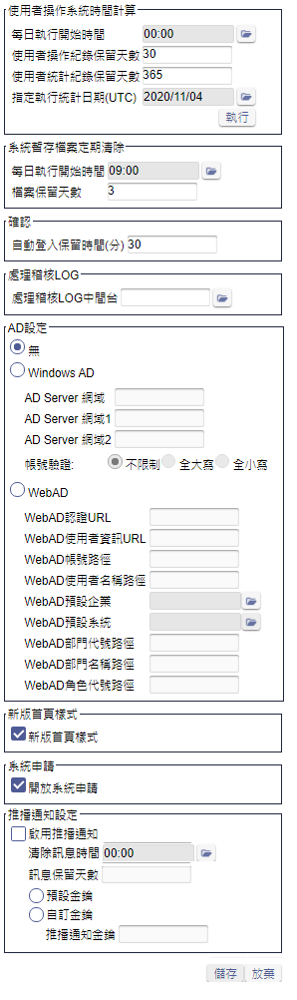

### 
規劃人員

* 正傑

### 
規劃日期

* 2020/11/04

### 
TRAC

* 待開

### 
表單.其他參數 <path>(Site管理)</path>

* 異動
* 規格說明
    * 增加推播訊息相關設定，用來管理推播訊息的保存時間。
    * 增加欄位.推播通知訊息保留天數，數字型態欄位，不可空白，不可輸入小於0的數字，若為0則不執行清除訊息，欄位預設值為30。
* 表單畫面

       
* 畫面規格說明
    * 欄位.訊息保留天數 : 推播通知的保留天數，自發送成功日期起算，每日系統排程會將超過保留天數的推播通知以及相關超連結資料刪除。
* 作業流程
    * 儲存

    
