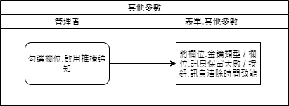
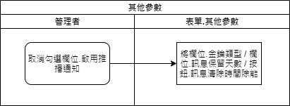

### 
規劃人員

* 正傑

### 
規劃日期

* 2020/11/04

### 
TRAC

* 待開

### 
表單.其他參數 <path>(Site管理)</path>

* 異動
* 規格說明
    * 增加推播訊息相關設定，用來管理推播訊息的保存時間。
    * 增加欄位.啟用推播通知，表示Site是否可啟用推播通知功能，未勾選時表示所有推播通知功能都禁止執行，推播通知相關設定欄位都除能。
    * 增加欄位.推播通知金鑰類型，表示推播通知使用的API金鑰類型，設定為預設表示MAE預設值，設定為自訂時表示因客戶需求有客製MAE，需另行申請API金鑰。
    * 增加欄位.推播通知金鑰，表示自訂發送推播通知時的API金鑰內容值。
    * 增加欄位.推播通知訊息清除時間，表示推播通知紀錄清除排程的啟動時間，不可輸入，僅可點擊按鈕進行時段挑選。
    * 增加欄位.推播通知訊息保留天數，表示推播通知紀錄自發送日期起算多久會被系統排程刪除。僅能輸入數字，不可空白，不可輸入小於0的數字，若為0則不執行清除訊息，欄位預設值為30。
* 表單畫面

       
* 畫面規格說明
    * 欄位.啟用推播通知 : 勾選欄位
        * 勾選時
            * 欄位.金鑰類型致能，選項設定為預設金鑰。
            * 欄位.訊息保留天數致能，設定預設值30。
            * 按鈕.清除訊息時間致能。
        * 未勾選時
            * 欄位.金鑰類型除能，選項設定為預設金鑰。
            * 欄位.訊息保留天數除能，清空欄位值。
            * 按鈕.清除訊息時間除能。
    * 欄位.清除訊息時間 : 不可輸入，僅能點擊按鈕挑選時段。表示清除訊息的系統排程啟動時間。
    * 欄位.訊息保留天數 : 推播通知的保留天數，自發送日期起算，每日系統排程會將超過保留天數的推播通知以及相關超連結資料刪除。
        * 僅能輸入數字。
        * 不可輸入小於0的數字，若為0則不執行清除訊息。
        * 預設值為30。
    * 欄位.金鑰類型 : 發送推播通知的金鑰，共有以下選項 : 
        * 預設金鑰 : 使用MAE預設API金鑰，勾選此選項時，欄位.推播通知金鑰除能並清空內容值。
        * 自訂金鑰 : 使用客製MAE另行申請的API金鑰，勾選此選項時，欄位.推播通知金鑰致能。
    * 欄位.推播通知金鑰 : 針對客製MAE另行申請的API金鑰。
    * 按鈕.儲存 : 增加以下欄位驗證
        * 若欄位.啟用推播通知有勾選，則欄位.訊息保留天數 / 欄位.清除訊息時間 不可空白。
        * 若欄位.金鑰類型為自訂金鑰，則欄位.推播通知金鑰不可空白。
        * 若欄位.清除訊息時間 有異動時，須重啟該排程。

* 作業流程
    * 開啟畫面

    
    * 啟用推播通知

    
    * 停用推播通知

    
    * 挑選清除訊息時間

    
    * 使用預設金鑰

    
    * 使用自訂金鑰

    
    * 儲存

    
