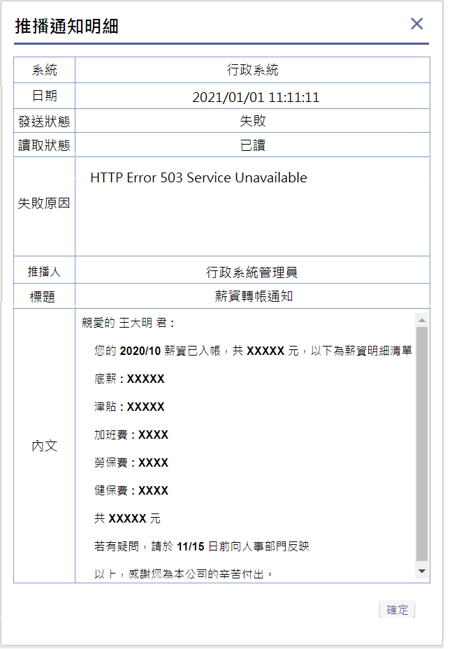

### 
規劃人員

* 正傑

### 
規劃日期

* 2020/11/04

### 
TRAC

* 待開

### 
表單.推播通知明細 <path>(首頁)</path>

* 擴充
* 規格說明
    * 顯示一筆指定的推播通知資料

* 表單畫面

       
* 畫面規格說明
    * 欄位.系統 : 顯示指定推播通知紀錄所屬系統。
    * 欄位.狀態 : 顯示指定推播通知紀錄狀態。
    * 欄位.日期 : 顯示指定推播通知紀錄發送成功日期。
    * 欄位.推播人 : 顯示指定推播通知紀錄的推播人姓名。
	* 欄位.標題 : 顯示指定推播通知紀錄的標題。
    * 表格.內文 : 顯示指定推播通知紀錄的內文，若顯示不下，則出現scrollbar。

* 作業流程
    * 開啟推播通知明細畫面

       
    * 點擊按鈕.確認，關閉表單

       
