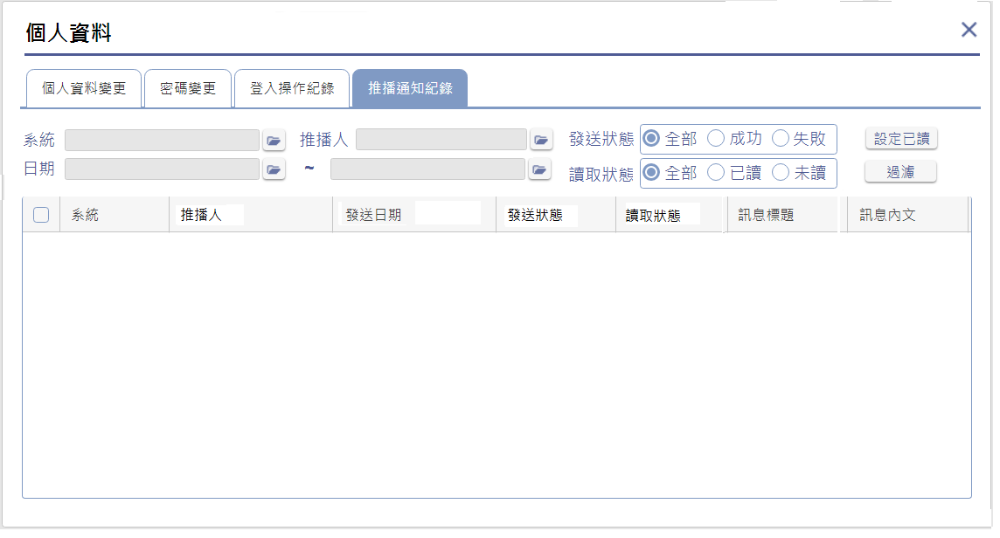
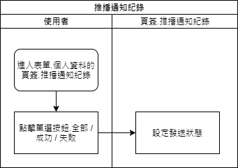
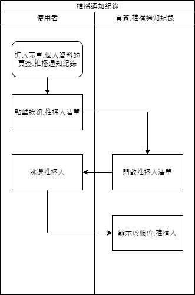
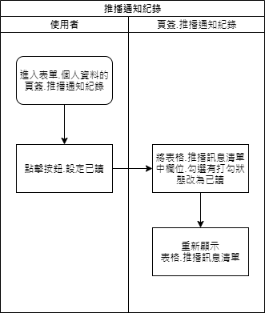

### 
規劃人員

* 正傑

### 
規劃日期

* 2020/11/04

### 
TRAC

* 待開

### 
表單.個人資料 <path>(首頁)</path>

* 異動
* 規格說明
    * 增加頁簽.推播通知紀錄，用來記錄該登入人員已接收的推播通知。可使用以下條件進行過濾 :
        * 系統 : 該使用者所已收推播通知的系統清單。
        * 推播人 : 該使用者所已收推播通知的發送者清單。
        * 日期區間 : 推播通知的發送日期。
        * 推播通知發送狀態 : 推播通知發送成功或失敗。
        * 推播通知讀取狀態 : 推播通知已讀或未讀。
    * 在頁簽.推播通知紀錄，可批次勾選將推播通知的狀態改為已讀。
* 表單畫面

       
* 畫面規格說明
    * 欄位.系統 : 不可輸入，僅能點擊按鈕開啟系統清單，從該使用者的推播通知所屬系統中，進行系統挑選，表示推播通知由哪個系統發出。
    * 欄位.發送狀態 : 表示播通知發送狀態，單選按鈕，可選擇以下項目 :
        * 全部 : 包含狀態為 成功 / 失敗 的推播通知。
        * 成功 : 狀態為 成功 的推播通知。
        * 失敗 : 狀態為 失敗 的推播通知。
    * 欄位.讀取狀態 : 表示該推播通知讀取狀態，單選按鈕，可選擇以下項目 :
        * 全部 : 包含狀態為 已讀 / 未讀 的推播通知。
        * 已讀 : 狀態為 已讀 的推播通知。
        * 未讀 : 狀態為 未讀 的推播通知。
    * 欄位.推播人 : 不可輸入，僅能點擊按鈕開啟推播人清單，從該使用者已收到的推播通知的發送者資訊，進行推播人挑選，表示推播通知由哪位發送者發出。
    * 欄位.起始日期 : 不可輸入，僅能點擊按鈕挑選日期，表示過濾推播通知發送日期的開始日期。
    * 欄位.結束日期 : 不可輸入，僅能點擊按鈕挑選日期，表示過濾推播通知發送日期的結束日期。
    * 按鈕.過濾 : 點擊後，依據欄位.系統 / 欄位.推播人 / 欄位.發送狀態 / 欄位.讀取狀態 / 欄位.起始日期/ 欄位.結束日期 進行使用者已接收的推播通知過濾，並顯示在表格.推播訊息清單。
    * 表格.推播訊息清單 : 顯示使用者已接收推播訊息的表格。
        * 欄位.勾選 : 勾選按鈕，勾選後表示該筆推播通知在點擊按鈕.設定已讀後，狀態會被變更為已讀。點擊欄位標題的勾選按鈕，表示目前清單資料全選，清除勾選表示目前清單資料全不選。
        * 欄位.系統 : 顯示該筆推播通知所屬系統名稱，雙擊欄位開啟表單.推播通知明細。
        * 欄位.推播人 : 顯示該筆推播通知的發送者名稱，雙擊欄位開啟表單.推播通知明細。
        * 欄位.發送日期 : 顯示該筆推播通知發送日期，雙擊欄位開啟表單.推播通知明細。
        * 欄位.發送狀態 : 顯示該筆推播通知的發送狀態是成功或失敗，雙擊欄位開啟表單.推播通知明細。
        * 欄位.讀取狀態 : 顯示該筆推播通知目前的讀取狀態是已讀或未讀，雙擊欄位開啟表單.推播通知明細。
        * 欄位.訊息標題 : 顯示該筆推播通知的標題，雙擊欄位開啟表單.推播通知明細。
        * 欄位.訊息內文 : 顯示該筆推播通知的內文，雙擊欄位開啟表單.推播通知明細。

* 作業流程
    * 開啟推播通知紀錄畫面

      
    * 設定過濾條件.系統

      
    * 設定過濾條件.發送狀態

      
    * 設定過濾條件.讀取狀態

      
    * 設定過濾條件.起始日期

      
    * 設定過濾條件.結束日期

      
    * 設定過濾條件.推播人

      
    * 過濾推播通知紀錄

      
    * 全選推播紀錄

      
    * 全不選推播紀錄

      
    * 將推播通知紀錄狀態設為已讀

      
    * 雙擊一筆推播通知紀錄，開啟表單.推播通知明細

      
