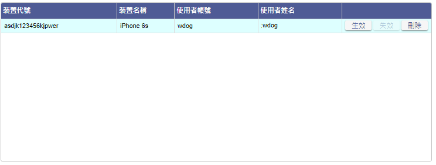

### 
規劃人員

* 正傑

### 
規劃日期

* 2020/11/04

### 
TRAC

* 待開

### 
表單.推播通知管理 <path>(Site管理)</path>

* 擴充
* 規格說明
    * 該表單用來管理裝置接收推播通知的能力。
    * 該表單僅企業管理員權限可開啟。
    * 若為企業管理員，表單開啟後，依據以下條件列出裝置清單 : 
        * 裝置為主要裝置，且使用者隸屬於企業管理員的企業。
        * 裝置為共用裝置，最後使用者隸屬於企業管理員的企業。
* 表單畫面

    
* 畫面規格說明
    * 表格.裝置清單 : 顯示裝置資訊的表格。
        * 欄位.裝置代號 : 該裝置註冊於Firebase的Token，發送推播通知會以該欄位資料進行發送，點擊欄位標題，依該欄位重新排序。
        * 欄位.裝置名稱 : 該裝置的名稱，該欄位為預設排序欄位。點擊欄位標題，依該欄位重新排序。
        * 欄位.使用者帳號 : 設定該裝置為主要裝置的使用者帳號，或該裝置為共用裝置，顯示最後登入的使用者帳號，若無上述資訊則顯示空白。點擊欄位標題，依該欄位重新排序。
        * 欄位.使用者姓名 : 欄位.使用者帳號對應的使用者姓名，若欄位.帳號為空白，則顯示空白。點擊欄位標題，依該欄位重新排序。
        * 按鈕.生效 : 點擊後將該裝置接收推播通知的功能生效，若為已生效的裝置紀錄，該按鈕除能。
        * 按鈕.失效 : 點擊後將該裝置接收推播通知的功能失效，若為已失效的裝置紀錄，該按鈕除能。
        * 按鈕.刪除 : 點擊後刪除該裝置的紀錄，權限等同失效。

* 作業流程
    * 開啟畫面

    
    * 生效裝置接收推播通知

    
    * 失效裝置接收推播通知

    
    * 刪除裝置

    
    * 點擊 欄位.裝置代號 / 欄位.裝置名稱 / 欄位.使用者帳號 / 欄位.使用者姓名 標題進行排序
    
    
