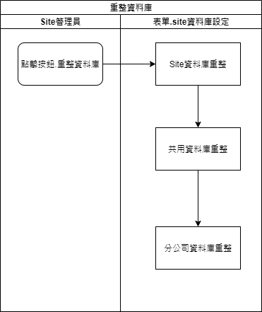

### 
規劃人員

* 正傑

### 
規劃日期

* 2020/11/04

### 
TRAC

* 待開

### 
升級轉資料 <path>(Site管理)</path>

* 異動
* 規格說明
    * 因以下項目需調整升級轉資料
        * Site管理
            * 新增表單.推播通知管理 : 新增系統表格。
            * 修改表單.其他參數 : 增加欄位.刪除超過保留天數的推播通知。
        * RTE首頁擴充以下兩項 :
            * 擴充表單.推播通知明細 : 新增系統表格。
* 表單畫面

       
* 畫面規格說明
    * 按鈕.重整資料庫
        * 執行
            * Site資料庫
                * 建立此次擴充的系統實體
                * 異動此次擴充欄位的系統實體
* 作業流程
    * 重整資料庫

    
