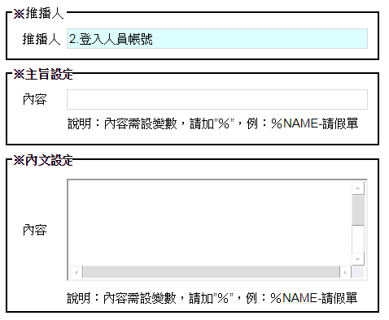

### 
規劃人員

* ella

### 
規劃日期

* 2020/12/15

### 
TRAC

* 待開

### 
推播通知設定 <path>(系統工具)</path>

* 規格說明
    * 推播通知內文設定
    
* 表單畫面

       

* 畫面規格說明
    * 推播人:下拉(1.系統帳號 2.登入人員帳號)
    * 主旨:欄位.主旨
    * 內文:欄位.內文

* 作業流程
    * 系統存回

    