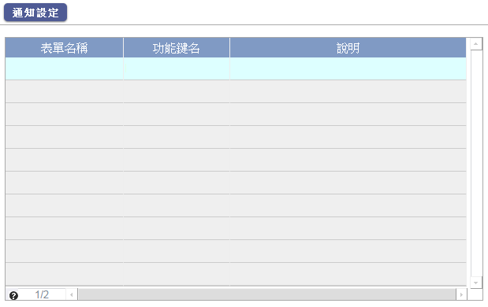
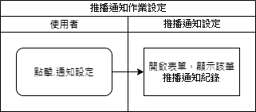

### 
規劃人員

* ella

### 
規劃日期

* 2020/12/15

### 
TRAC

* 待開

### 
推播通知作業設定 <path>(系統工具)</path>

* 規格說明
    * 顯示推播通知清單
    
* 表單畫面

    

* 畫面規格說明
    * 表單名稱:顯示 多語表單名稱
    * 功能鍵名:顯示 多語功能鍵名稱
    * 說明:顯示 說明
    * 通知設定:開啟<<推播通知設定>>

* 作業流程
    * 通知設定

    