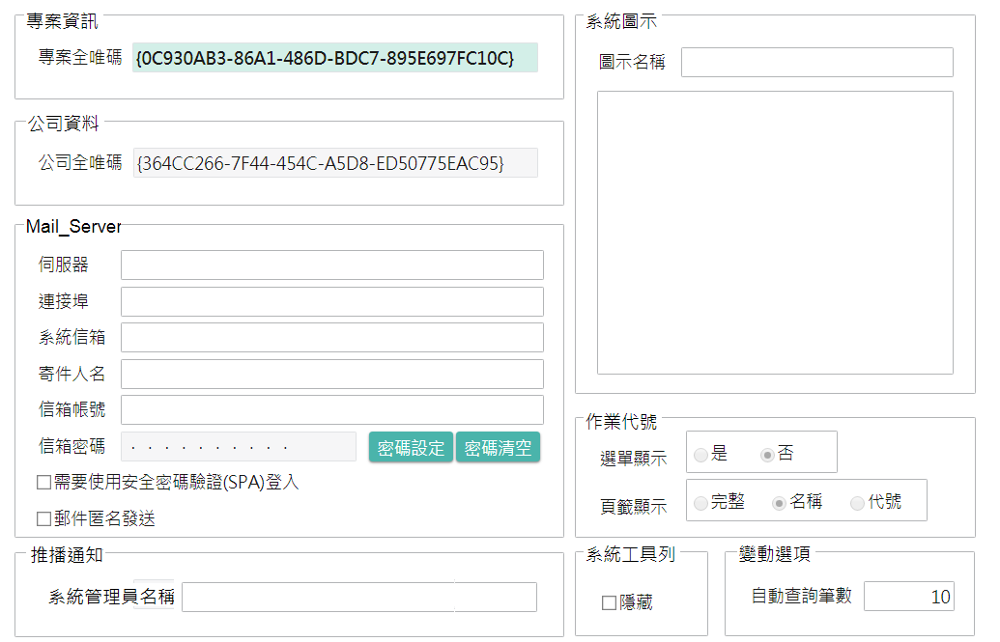
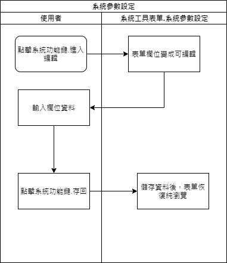

### 
規劃人員

* 正傑

### 
規劃日期

* 2020/11/10

### 
TRAC

* 待開

### 
系統參數設定 <path>(系統工具)</path>

* 異動
* 規格說明
    * 增加推播訊息相關設定，用來設定推播通知系統管理員名稱。
* 表單畫面

       
* 畫面規格說明
    * 增加欄位.系統管理員名稱，提供給`按鍵加註`的`推播通知`功能，當`推播人`設定為管理者時的資訊。

* 作業流程
    * 系統存回

    