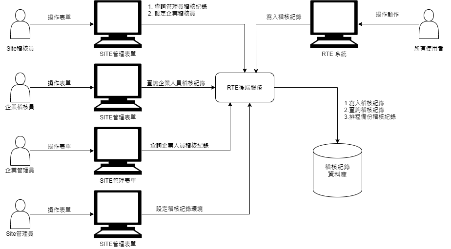

# AuditLog Viewer [未執行]

### 
需求功能

### 
需求說明

* 在既有的稽核紀錄流程下進行以下修正
    * 把稽核紀錄資料庫移到Site管理進行設定，資料庫設定不可為空白，並儲存設定異動記錄，並可以設定排程時間
    * 異動資料表組成, 改為：
        * 記錄近30天的異動LOG檔
        * 依年度月份個別計錄的月份檔
    * 排程時間執行以下作業：
        * 把異動LOG檔(記錄最近30天)裡的資料, 將超過30天的記錄, 複製到對應的年度月份檔
        * 刪除超出30天的紀錄
        * 年度月份擋在Site提供參數讓管理員指定保留份數（預設為6，不得為0）
        * 刪除超出保留份數的年度月份檔
    * 增加稽核管理員的角色：
        * 區分Site、企業兩個層級
        * 企業稽核員預設篩選相同企業的系統紀錄
        * 企業稽核員由Site稽核員指定
        * Site稽核員 於首次登入時強制更新密碼，不更新不得使用
    * 增加【稽核紀錄查詢】頁面, 企業管理員及稽核管理員, 可操作
        * Site稽核員僅檢視Site管理員及企業稽核員作業紀錄
        * 企業稽核員僅檢視相同企業所有人員紀錄
    * 【稽核紀錄查詢】可依查詢條件, 匯出CSV檔
    * 【稽核紀錄查詢】頁面, 點選 內容鍵, 可查詢駐留筆內容, 僅稽核管理員 可執行
    * 增加【稽核紀錄內容】頁面, 僅 稽核管理員, 可檢視
* 增加以下稽核參數
    * 表單名稱 : 站台管理表單名稱 / 稱應用系統表單名
        * 紀錄語系
            * 站台管理表單 - 英語
            * 應用系統表單 - 系統預設主要語系

    * 增加動作類型，依SERVLETPATH區分是查詢或異動
    * 附件 [稽核項目清單]中保留欄位為{X}的不做稽核紀錄的寫入
    * 後續如果RTE新增站台表單、服務(API)涉及資料查詢、資料異動均需要列入[稽核項目清單]表單管理，請需求來源確認

    #### 附件 [稽核項目清單](https://docs.google.com/spreadsheets/d/1JVLJAa9XyQxCIEuPNR-z6Ex4F39gIEC9/edit#gid=29312194)

