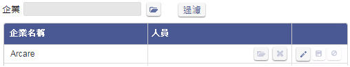
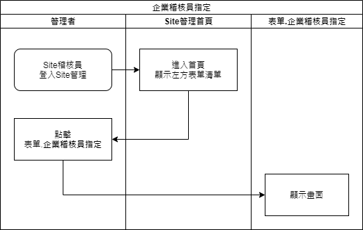
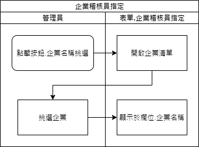
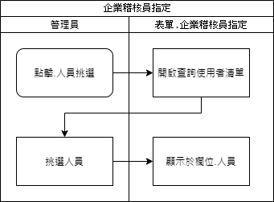
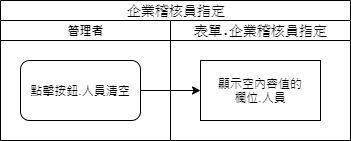
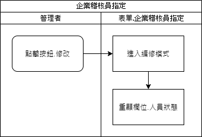
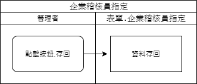
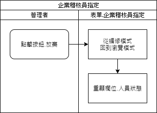

### 
規劃人員

* ella

### 
規劃日期

* 2020/12/11

### 
TRAC

* #8264

### 
表單.企業稽核員指定 <path>(Site管理)</path>

* 規格說明
    * 僅【Site稽核員】可使用，指定企業稽核員。
    * 可依照企業過濾
    * 人員可空白

* 表單畫面

    

* 畫面規格說明
    * 欄位.企業
        * 顯示企業名稱
        * 可空白
        * 開啟<<企業清單>>，挑選企業名稱
    * 按鈕.過濾
        * 有挑選企業，依照挑選的企業過濾
        * 無挑選企業，過濾所有企業
    * 欄位.企業名稱
        * 顯示企業名稱
    * 欄位.人員
        * 瀏覽模式下:
            * 顯示用戶姓名
        * 編輯模式下:
            * 可空白
            * 開啟<<查詢使用者清單>>，過濾企業唯一號，挑選使用者姓名
            * 執行清空按鈕，將欄位內容值清空
    * 按鈕.修改
        * 執行進入編修模式
    * 按鈕.存回
        * 編修模式下致能
        * 執行後將資訊存回
    * 按鈕.放棄
        * 編修模式下致能
        * 執行後回到瀏覽模式

* 作業流程
    * 開啟畫面

    

    * 企業名稱挑選

    

    * 人員挑選

    

    * 人員清空

    

    * 修改

    

    * 存回

    

    * 放棄

    